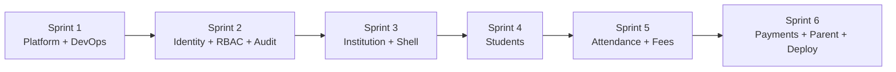

# MVP Phase 1 — All Sprints (Master Sprint Document)

**Phase:** MVP Phase 1  
**Duration:** 12 weeks / 6 sprints (2 weeks each)  
**Goal:** Operable multi-tenant SaaS — onboard schools, manage students, mark attendance, collect fees, parent views data  
**Total L4 tasks:** 239 | **Estimated story points:** ~370

---

## Related Files

| File | Use For |
|---|---|
| [`mvp-phase1-linear-import.csv`](mvp-phase1-linear-import.csv) | L4 task backlog (Linear/Jira import) |
| [`MVP-PHASE1-SPRINT-GUIDE.md`](MVP-PHASE1-SPRINT-GUIDE.md) | Import instructions, DoD, Cursor prompt template |
| [`sprint-1-l5-subtasks.md`](sprint-1-l5-subtasks.md) | **Sprint 1 only** — full L5 subtask expansion (~142 subtasks) |
| [`sprint-1-l5-linear-import.csv`](sprint-1-l5-linear-import.csv) | Sprint 1 L5 subtasks for Linear |
| [`../student_management_saas_complete_module_plan.md`](../student_management_saas_complete_module_plan.md) | Master module plan and phase roadmap |
| [`../.cursor/rules/`](../.cursor/rules/) | Architecture rules (auto-apply during implementation) |
| [`../AGENTS.md`](../AGENTS.md) | AI agent entry point |

---

## Sprint Calendar

| Sprint | Weeks | Theme | L4 Tasks | Est. SP | Exit Criteria |
|---|---|---|---|---|---|
| **Sprint 1** | 1–2 | Platform Foundation + DevOps baseline | 30 | ~55 | Solution builds, tenant isolation proven, CI green, Docker local stack |
| **Sprint 2** | 3–4 | Identity, RBAC, Audit, Angular auth | 55 | ~60 | Login works, permissions enforced, audit captured, admin can login |
| **Sprint 3** | 5–6 | Institution + Admin shell | 39 | ~65 | Tenant provisioning, academic structure CRUD, admin navigation |
| **Sprint 4** | 7–8 | Student Management | 31 | ~55 | Student CRUD, guardians, enrollment, admin UI complete |
| **Sprint 5** | 9–10 | Attendance + Fees (structure/invoicing) | 31 | ~60 | Daily attendance marking, fee structures, invoice generation |
| **Sprint 6** | 11–12 | Payments, Notifications, Parent App, Deploy | 53 | ~75 | End-to-end MVP live on staging VPS |

---

## Team Assignment Matrix

| Stream | Owner | Sprints Active | Primary Epics |
|---|---|---|---|
| **Backend Core** | Backend Dev 1 | 1–6 | Platform Foundation, Identity, Audit |
| **Backend Domain** | Backend Dev 2 | 3–6 | Institution, Student, Attendance, Fees |
| **Frontend Admin** | Frontend Dev | 2–6 | Admin Web App |
| **Mobile Parent** | Mobile Dev | 6 | Parent Mobile App |
| **DevOps** | DevOps / Full-stack | 1, 6 | DevOps & Deployment |
| **QA** | QA / Any dev | 2–6 | Testing tasks across epics |

---

## Implementation Hierarchy

```
Level 1: Domain          → e.g. Student Lifecycle
Level 2: Module          → e.g. Student Management
Level 3: Feature         → e.g. Guardian Linking
Level 4: Small Task      → e.g. LinkGuardianToStudentCommand  (this doc + CSV)
Level 5: Subtask         → e.g. Create StudentGuardianEntity  (sprint-1-l5-subtasks.md for Sprint 1)
```

**L5 expansion status:**

| Sprint | L5 Doc | Status |
|---|---|---|
| Sprint 1 | [`sprint-1-l5-subtasks.md`](sprint-1-l5-subtasks.md) | Complete (~142 subtasks) |
| Sprints 2–6 | — | Expand per sprint using Sprint 1 format before sprint start |

---

## Definition of Done (All Sprints)

Every L4 task is **done** when:

- [ ] Code merged to `develop` branch
- [ ] Unit test(s) pass for handler/service logic
- [ ] Integration test passes where applicable
- [ ] RBAC permission defined and enforced (if API/command)
- [ ] Audit entry written on write operations
- [ ] Tenant isolation verified (no cross-tenant leak)
- [ ] FluentValidation validator exists (if command)
- [ ] Swagger documents endpoint (if API)
- [ ] No linter/architecture test violations

---

# Sprint 1 — Platform Foundation + DevOps Baseline

**Weeks:** 1–2  
**Epics:** Platform Foundation, DevOps & Deployment  
**L4 tasks:** 30 | **L5 subtasks:** ~142 (see dedicated doc)

## Goal

Solution builds cleanly, multi-tenancy is proven, outbox pattern works, CI is green, local Docker stack runs.

## Critical Path (must complete before Sprint 2)

```
CreateSolutionStructure
DefineBaseEntity
ConfigureEfCorePostgreSql
DefineITenantContext
ImplementTenantContextMiddleware
CreateTenantQueryFilter
CreateTenantSaveChangesInterceptor
RegisterMediatRPipeline
CreateValidationBehavior
CreateLoggingBehavior
CreateTenantBehavior
DefineResultPattern
DefineGlobalExceptionHandler
ConfigureApiVersioning
ConfigureSwaggerOpenApi
CreateTenantsTableMigration
DefineIntegrationEventBase
CreateOutboxMessageEntity → ImplementOutboxSaveChangesInterceptor → CreateOutboxPublisherBackgroundService
ConfigureRedisConnection → CreateICacheService
TenantIsolationIntegrationTest
CreateDockerComposeLocal
CreateDockerfileApi
CiBuildApiWorkflow
```

## All L4 Tasks

| Task | Epic | SP |
|---|---|---|
| CreateSolutionStructure | Platform Foundation | 3 |
| DefineBaseEntity | Platform Foundation | 2 |
| ConfigureEfCorePostgreSql | Platform Foundation | 3 |
| DefineITenantContext | Platform Foundation | 2 |
| ImplementTenantContextMiddleware | Platform Foundation | 3 |
| CreateTenantQueryFilter | Platform Foundation | 3 |
| CreateTenantSaveChangesInterceptor | Platform Foundation | 2 |
| RegisterMediatRPipeline | Platform Foundation | 2 |
| CreateValidationBehavior | Platform Foundation | 2 |
| CreateLoggingBehavior | Platform Foundation | 2 |
| CreateTenantBehavior | Platform Foundation | 2 |
| DefineResultPattern | Platform Foundation | 2 |
| DefineGlobalExceptionHandler | Platform Foundation | 3 |
| ConfigureApiVersioning | Platform Foundation | 2 |
| ConfigureSwaggerOpenApi | Platform Foundation | 2 |
| ConfigureFluentValidationAssemblyScan | Platform Foundation | 1 |
| CreateTenantsTableMigration | Platform Foundation | 2 |
| CreateTenantSettingsTableMigration | Platform Foundation | 1 |
| DefineIntegrationEventBase | Platform Foundation | 2 |
| CreateOutboxMessageEntity | Platform Foundation | 2 |
| ImplementOutboxSaveChangesInterceptor | Platform Foundation | 3 |
| CreateOutboxPublisherBackgroundService | Platform Foundation | 5 |
| ConfigureRedisConnection | Platform Foundation | 2 |
| CreateICacheService | Platform Foundation | 2 |
| CreateTestProjectStructure | Platform Foundation | 2 |
| CreateArchitectureTestRules | Platform Foundation | 2 |
| TenantIsolationIntegrationTest | Platform Foundation | 3 |
| CreateDockerComposeLocal | DevOps & Deployment | 3 |
| CreateDockerfileApi | DevOps & Deployment | 2 |
| CiBuildApiWorkflow | DevOps & Deployment | 3 |

## Exit Checklist

| # | Criterion | Verified |
|---|---|---|
| 1 | `dotnet build` zero warnings | [ ] |
| 2 | `dotnet test` all pass including architecture + tenant isolation | [ ] |
| 3 | `docker compose up` starts postgres, redis, rabbitmq | [ ] |
| 4 | API Docker image builds and `/health` responds | [ ] |
| 5 | CI pipeline green on PR | [ ] |
| 6 | Tenant query filter enforced (integration test) | [ ] |
| 7 | Outbox message published to RabbitMQ (integration test) | [ ] |
| 8 | Swagger accessible with JWT scheme documented | [ ] |
| 9 | MediatR pipeline: Validation → Logging → Tenant behaviors work | [ ] |
| 10 | All code follows `.cursor/rules/` conventions | [ ] |

## Sprint 1 → Sprint 2 Handoff

When all exit criteria pass:

- `CreateUserEntity` can inherit `BaseEntity`
- Auth middleware can populate `ITenantContext.UserId`
- `CreateAuthorizationBehavior` plugs into existing MediatR pipeline
- `AuditBehavior` plugs into existing MediatR pipeline
- Angular workspace can call versioned `/api/v1/` endpoints

**Gate:** Do NOT start Sprint 2 until `TenantIsolationIntegrationTest` is in CI and passing.

**Deep dive:** [`sprint-1-l5-subtasks.md`](sprint-1-l5-subtasks.md)

---

# Sprint 2 — Identity, RBAC, Audit, Angular Auth

**Weeks:** 3–4  
**Epics:** Identity & RBAC, Audit & Compliance, Admin Web App (auth only)  
**L4 tasks:** 55

## Goal

Users can log in, permissions are enforced on every command/query, audit is auto-captured, Angular admin login works.

## Critical Path

```
CreateUserEntity + CreateUsersTableMigration
RegisterUserCommand → InviteUserCommand → AcceptInvitationCommand
LoginCommand → GenerateJwtTokenService → RefreshTokenCommand → RevokeRefreshTokenCommand
LoginAttemptTracker
ForgotPasswordCommand → ResetPasswordCommand → ChangePasswordCommand
All auth endpoints (Login, Refresh, Logout, Register, Invite, Me)
DefinePermissionCatalog → SeedPermissionsCommand
CreateRoleEntity → CreateRoleCommand → AssignPermissionsToRoleCommand → AssignRoleToUserCommand
PermissionResolverService → CreateAuthorizationBehavior → ScopeResolverService
SeedDefaultRolesMigration
All RBAC endpoints
CreateAuditLogEntity → AuditLogService → CreateAuditBehavior → EntityChangeCaptureInterceptor
ListAuditLogsEndpoint
CreateAngularWorkspace → AuthService → LoginPageComponent → AuthGuard → TokenRefreshInterceptor
```

## All L4 Tasks

| Task | Epic | SP |
|---|---|---|
| CreateUserEntity | Identity & RBAC | 2 |
| CreateUsersTableMigration | Identity & RBAC | 2 |
| RegisterUserCommand | Identity & RBAC | 3 |
| RegisterUserValidator | Identity & RBAC | 2 |
| InviteUserCommand | Identity & RBAC | 3 |
| AcceptInvitationCommand | Identity & RBAC | 3 |
| LoginCommand | Identity & RBAC | 3 |
| GenerateJwtTokenService | Identity & RBAC | 3 |
| GenerateRefreshTokenService | Identity & RBAC | 3 |
| RefreshTokenCommand | Identity & RBAC | 3 |
| RevokeRefreshTokenCommand | Identity & RBAC | 2 |
| LoginAttemptTracker | Identity & RBAC | 3 |
| ForgotPasswordCommand | Identity & RBAC | 3 |
| ResetPasswordCommand | Identity & RBAC | 3 |
| ChangePasswordCommand | Identity & RBAC | 2 |
| LoginEndpoint | Identity & RBAC | 1 |
| RefreshTokenEndpoint | Identity & RBAC | 1 |
| LogoutEndpoint | Identity & RBAC | 1 |
| RegisterUserEndpoint | Identity & RBAC | 1 |
| InviteUserEndpoint | Identity & RBAC | 1 |
| GetCurrentUserEndpoint | Identity & RBAC | 1 |
| JwtTokenGenerationTest | Identity & RBAC | 2 |
| RefreshTokenRotationTest | Identity & RBAC | 2 |
| AccountLockoutTest | Identity & RBAC | 2 |
| DefinePermissionCatalog | Identity & RBAC | 3 |
| CreatePermissionsTableMigration | Identity & RBAC | 2 |
| SeedPermissionsCommand | Identity & RBAC | 2 |
| CreateRoleEntity | Identity & RBAC | 2 |
| CreateRoleCommand | Identity & RBAC | 2 |
| AssignPermissionsToRoleCommand | Identity & RBAC | 3 |
| AssignRoleToUserCommand | Identity & RBAC | 3 |
| PermissionResolverService | Identity & RBAC | 5 |
| CreateAuthorizationBehavior | Identity & RBAC | 3 |
| ScopeResolverService | Identity & RBAC | 5 |
| SeedDefaultRolesMigration | Identity & RBAC | 2 |
| ListRolesEndpoint | Identity & RBAC | 1 |
| CreateRoleEndpoint | Identity & RBAC | 1 |
| AssignPermissionsEndpoint | Identity & RBAC | 1 |
| AssignUserRoleEndpoint | Identity & RBAC | 1 |
| GetUserPermissionsEndpoint | Identity & RBAC | 1 |
| ScopeResolverUnitTest | Identity & RBAC | 2 |
| CreateAuditLogEntity | Audit & Compliance | 2 |
| CreateAuditLogsTableMigration | Audit & Compliance | 2 |
| AuditLogService | Audit & Compliance | 3 |
| CreateAuditBehavior | Audit & Compliance | 3 |
| EntityChangeCaptureInterceptor | Audit & Compliance | 3 |
| ListAuditLogsEndpoint | Audit & Compliance | 2 |
| AuditLogCaptureIntegrationTest | Audit & Compliance | 2 |
| CreateAngularWorkspace | Admin Web App | 3 |
| DefineEnvironmentConfigService | Admin Web App | 1 |
| CreateHttpInterceptorChain | Admin Web App | 3 |
| LoginPageComponent | Admin Web App | 3 |
| AuthService | Admin Web App | 3 |
| AuthGuard | Admin Web App | 2 |
| TokenRefreshInterceptor | Admin Web App | 3 |

## Exit Checklist

| # | Criterion | Verified |
|---|---|---|
| 1 | Login, refresh, logout flow works end-to-end | [ ] |
| 2 | JWT contains `tenant_id`, `user_id`, role claims | [ ] |
| 3 | Account lockout after N failed attempts | [ ] |
| 4 | `[RequirePermission]` enforced via AuthorizationBehavior | [ ] |
| 5 | Default roles seeded (Admin, Teacher, Accountant, Parent, Student) | [ ] |
| 6 | Scope resolver filters data by branch/class assignment | [ ] |
| 7 | Audit entry created on every write command | [ ] |
| 8 | Angular login page authenticates and stores tokens | [ ] |
| 9 | AuthGuard protects routes; token auto-refreshes | [ ] |
| 10 | Architecture test: all commands/endpoints have `[RequirePermission]` | [ ] |

## Sprint 2 → Sprint 3 Handoff

- Tenant provisioning can assign default roles and admin user
- PermissionGuard and `*hasPermission` directive can use `GetUserPermissionsEndpoint`
- Staff entities can link to `users` table
- Admin shell can mount authenticated routes

---

# Sprint 3 — Institution + Admin Shell

**Weeks:** 5–6  
**Epics:** Institution Management, Admin Web App (shell + institution UI)  
**L4 tasks:** 39

## Goal

Super-admin can provision tenants; school admin can manage academic structure; admin app has full navigation shell.

## Critical Path

```
CreateTenantCommand → TenantProvisioningService
CreateAcademicYearEntity → CreateAcademicYearsTableMigration
CreateAcademicYearCommand → SetCurrentAcademicYearCommand
CreateGradeEntity → CreateGradesTableMigration
CreateGradeCommand → CreateClassCommand → CreateSectionCommand
CreateSubjectEntity → CreateSubjectCommand
CreateStaffEntity → CreateStaffCommand
AppShellLayoutComponent → SidebarNavigationComponent → PermissionGuard
AcademicYearListComponent → GradeClassTreeComponent → StaffListPageComponent
RoleListPageComponent → PermissionMatrixComponent
```

## All L4 Tasks

| Task | Epic | SP |
|---|---|---|
| CreateTenantCommand | Institution Management | 3 |
| TenantProvisioningService | Institution Management | 5 |
| SuspendTenantCommand | Institution Management | 2 |
| CreateTenantEndpoint | Institution Management | 1 |
| GetCurrentTenantEndpoint | Institution Management | 1 |
| TenantProvisioningIntegrationTest | Institution Management | 3 |
| CreateAcademicYearEntity | Institution Management | 2 |
| CreateAcademicYearsTableMigration | Institution Management | 2 |
| CreateAcademicYearCommand | Institution Management | 2 |
| SetCurrentAcademicYearCommand | Institution Management | 2 |
| AcademicYearOverlapValidator | Institution Management | 2 |
| CreateGradeEntity | Institution Management | 2 |
| CreateGradesTableMigration | Institution Management | 3 |
| CreateGradeCommand | Institution Management | 2 |
| CreateClassCommand | Institution Management | 2 |
| CreateSectionCommand | Institution Management | 2 |
| AssignClassTeacherCommand | Institution Management | 2 |
| CreateSubjectEntity | Institution Management | 2 |
| CreateSubjectCommand | Institution Management | 2 |
| AssignSubjectToClassCommand | Institution Management | 2 |
| CreateStaffEntity | Institution Management | 2 |
| CreateStaffCommand | Institution Management | 2 |
| LinkStaffToUserCommand | Institution Management | 2 |
| ListAcademicYearsEndpoint | Institution Management | 1 |
| CreateAcademicYearEndpoint | Institution Management | 1 |
| ListClassesEndpoint | Institution Management | 1 |
| CreateClassEndpoint | Institution Management | 1 |
| ListStaffEndpoint | Institution Management | 1 |
| AppShellLayoutComponent | Admin Web App | 5 |
| SidebarNavigationComponent | Admin Web App | 3 |
| PermissionGuard | Admin Web App | 2 |
| HasPermissionDirective | Admin Web App | 2 |
| AcademicYearListComponent | Admin Web App | 3 |
| GradeClassTreeComponent | Admin Web App | 5 |
| ClassFormDialogComponent | Admin Web App | 3 |
| StaffListPageComponent | Admin Web App | 3 |
| RoleListPageComponent | Admin Web App | 5 |
| PermissionMatrixComponent | Admin Web App | 5 |
| DataTableWrapperComponent | Admin Web App | 3 |

## Exit Checklist

| # | Criterion | Verified |
|---|---|---|
| 1 | Tenant provisioning creates tenant + default roles + admin atomically | [ ] |
| 2 | Tenant isolation verified after provisioning (integration test) | [ ] |
| 3 | Academic year CRUD with overlap validation | [ ] |
| 4 | Grade → Class → Section hierarchy CRUD | [ ] |
| 5 | Staff linked to user accounts | [ ] |
| 6 | Admin shell: sidebar, topbar, role-filtered nav | [ ] |
| 7 | Permission matrix UI assigns permissions to roles | [ ] |
| 8 | Shared AG Grid data table wrapper reusable | [ ] |
| 9 | All institution endpoints have RBAC + audit | [ ] |
| 10 | OpenAPI spec generated for frontend service sync | [ ] |

## Sprint 3 → Sprint 4 Handoff

- `CreateStudentEntity` can reference grades, classes, sections
- Enrollment can use current academic year
- `DataTableWrapperComponent` ready for student list
- Scope resolver can filter students by class assignment

---

# Sprint 4 — Student Management

**Weeks:** 7–8  
**Epics:** Student Management, Admin Web App (student UI)  
**L4 tasks:** 31

## Goal

Full student lifecycle: CRUD, enrollment, guardian linking, admin UI complete.

## Critical Path

```
CreateStudentEntity → CreateStudentsTableMigration
CreateStudentCommand → UpdateStudentCommand → DeleteStudentCommand
ListStudentsQuery → GetStudentByIdQuery (with scope enforcement)
EnrollStudentCommand → EnrollmentClassCapacityValidator
CreateGuardianEntity → CreateGuardianCommand → LinkGuardianToStudentCommand
GuardianLinkedDomainEvent → StudentAdmittedDomainEvent
All student/guardian endpoints
StudentListPageComponent → StudentCreateEditPageComponent → StudentDetailPageComponent
GuardianFormComponent → StudentGuardianListComponent
```

## All L4 Tasks

| Task | Epic | SP |
|---|---|---|
| CreateStudentEntity | Student Management | 3 |
| CreateStudentsTableMigration | Student Management | 3 |
| CreateStudentCommand | Student Management | 3 |
| UpdateStudentCommand | Student Management | 2 |
| DeleteStudentCommand | Student Management | 2 |
| ListStudentsQuery | Student Management | 5 |
| GetStudentByIdQuery | Student Management | 2 |
| CreateStudentValidator | Student Management | 2 |
| EnrollStudentCommand | Student Management | 3 |
| EnrollmentClassCapacityValidator | Student Management | 2 |
| CreateGuardianEntity | Student Management | 2 |
| CreateGuardianCommand | Student Management | 2 |
| LinkGuardianToStudentCommand | Student Management | 3 |
| GuardianLinkedDomainEvent | Student Management | 1 |
| StudentAdmittedDomainEvent | Student Management | 1 |
| CreateStudentEndpoint | Student Management | 1 |
| UpdateStudentEndpoint | Student Management | 1 |
| DeleteStudentEndpoint | Student Management | 1 |
| ListStudentsEndpoint | Student Management | 1 |
| GetStudentEndpoint | Student Management | 1 |
| EnrollStudentEndpoint | Student Management | 1 |
| CreateGuardianEndpoint | Student Management | 1 |
| LinkGuardianEndpoint | Student Management | 1 |
| CreateStudentCommandHandlerTest | Student Management | 2 |
| StudentScopeFilterTest | Student Management | 3 |
| LinkGuardianIntegrationTest | Student Management | 2 |
| StudentListPageComponent | Admin Web App | 5 |
| StudentCreateEditPageComponent | Admin Web App | 5 |
| StudentDetailPageComponent | Admin Web App | 5 |
| GuardianFormComponent | Admin Web App | 3 |
| StudentGuardianListComponent | Admin Web App | 3 |

## Exit Checklist

| # | Criterion | Verified |
|---|---|---|
| 1 | Student CRUD with soft delete and audit | [ ] |
| 2 | Admission number auto-generated and unique per tenant | [ ] |
| 3 | Enrollment respects class capacity | [ ] |
| 4 | Teacher sees only scoped students (integration test) | [ ] |
| 5 | Guardian linked with relationship type | [ ] |
| 6 | Guardian link triggers domain event (parent invite hook) | [ ] |
| 7 | Student list with search, grade/class filters | [ ] |
| 8 | Student detail tabs: info, guardians, enrollment | [ ] |
| 9 | All student endpoints have RBAC + validation | [ ] |
| 10 | StudentAdmittedDomainEvent ready for fee account hook | [ ] |

## Sprint 4 → Sprint 5 Handoff

- Attendance can reference enrolled students per class
- Fee invoices can reference student fee accounts
- Parent portal can resolve guardian → student links
- Student detail page ready for fee ledger tab (Sprint 6)

---

# Sprint 5 — Attendance + Fees (Structure / Invoicing)

**Weeks:** 9–10  
**Epics:** Attendance, Fees Management, Admin Web App (attendance + fees UI)  
**L4 tasks:** 31

## Goal

Teachers mark daily attendance; admins define fee structures and generate invoices.

## Critical Path

```
CreateAttendanceRecordEntity → MarkAttendanceCommand → UpdateAttendanceRecordCommand
GetClassAttendanceQuery → GetStudentAttendanceQuery
AttendanceEditWindowPolicy → AttendanceMarkedDomainEvent
CreateFeeCategoryEntity → CreateFeeStructureCommand → AssignFeeStructureToClassCommand
CreateFeeInvoiceEntity → GenerateFeeInvoicesCommand → ListFeeInvoicesQuery
AttendanceMarkingPageComponent → FeeStructureListComponent → GenerateInvoicesWizardComponent
```

## All L4 Tasks

| Task | Epic | SP |
|---|---|---|
| CreateAttendanceRecordEntity | Attendance | 2 |
| CreateAttendanceRecordsTableMigration | Attendance | 2 |
| MarkAttendanceCommand | Attendance | 5 |
| UpdateAttendanceRecordCommand | Attendance | 3 |
| GetClassAttendanceQuery | Attendance | 2 |
| GetStudentAttendanceQuery | Attendance | 2 |
| AttendanceEditWindowPolicy | Attendance | 2 |
| AttendanceMarkedDomainEvent | Attendance | 1 |
| MarkAttendanceValidator | Attendance | 2 |
| MarkAttendanceEndpoint | Attendance | 1 |
| GetClassAttendanceEndpoint | Attendance | 1 |
| UpdateAttendanceRecordEndpoint | Attendance | 1 |
| GetStudentAttendanceEndpoint | Attendance | 1 |
| MarkAttendanceCommandHandlerTest | Attendance | 2 |
| AttendanceEditWindowPolicyTest | Attendance | 2 |
| AttendanceMarkingPageComponent | Admin Web App | 8 |
| AttendanceStudentRowComponent | Admin Web App | 3 |
| CreateFeeCategoryEntity | Fees Management | 3 |
| CreateFeeStructuresTableMigration | Fees Management | 2 |
| CreateFeeStructureCommand | Fees Management | 3 |
| AssignFeeStructureToClassCommand | Fees Management | 2 |
| CreateFeeInvoiceEntity | Fees Management | 3 |
| CreateFeeInvoicesTableMigration | Fees Management | 3 |
| GenerateFeeInvoicesCommand | Fees Management | 5 |
| ListFeeInvoicesQuery | Fees Management | 2 |
| CreateFeeStructureEndpoint | Fees Management | 1 |
| GenerateFeeInvoicesEndpoint | Fees Management | 1 |
| ListFeeInvoicesEndpoint | Fees Management | 1 |
| FeeStructureListComponent | Admin Web App | 5 |
| GenerateInvoicesWizardComponent | Admin Web App | 5 |
| InvoiceListPageComponent | Admin Web App | 3 |

## Exit Checklist

| # | Criterion | Verified |
|---|---|---|
| 1 | Bulk attendance mark for class + date (upsert) | [ ] |
| 2 | Edit window policy enforced (same-day default) | [ ] |
| 3 | Absent students trigger AttendanceMarkedDomainEvent | [ ] |
| 4 | Fee structure CRUD with line items | [ ] |
| 5 | Fee structure assigned to class for academic year | [ ] |
| 6 | Bulk invoice generation for class/term | [ ] |
| 7 | Attendance marking UI: class selector, date, student rows | [ ] |
| 8 | Invoice list with status badges | [ ] |
| 9 | Parent API endpoints for student attendance history | [ ] |
| 10 | All attendance/fees endpoints have RBAC + audit | [ ] |

## Sprint 5 → Sprint 6 Handoff

- `RecordFeePaymentCommand` can apply to generated invoices
- Notification handlers can subscribe to attendance + fee events
- Parent app can consume attendance and fee ledger APIs
- Invoice list UI ready for payment collection form

---

# Sprint 6 — Payments, Notifications, Parent App, Deploy

**Weeks:** 11–12  
**Epics:** Fees (payments), Notifications, Admin Web App (payments/audit UI), Parent Mobile App, DevOps  
**L4 tasks:** 53

## Goal

End-to-end MVP: record payments, notify parents, parent app read-only views, staging deployment live.

## Critical Path

```
RecordFeePaymentCommand → CreateFeeReceiptEntity → GenerateFeeReceiptPdfQuery
CreateNotificationTemplateEntity → NotificationEventHandler → AttendanceAbsentNotificationHandler
CreateFlutterMonorepoStructure → ParentAuthFlow → ParentAppShell → ChildSelectorWidget
ChildAttendanceScreen → FeeSummaryScreen → NotificationInboxScreen
ProductionDockerComposeFile → NginxReverseProxyConfig → CdStagingDeployWorkflow
MVP Integration Test Suite → MVP Smoke Test Checklist
```

## All L4 Tasks

| Task | Epic | SP |
|---|---|---|
| RecordFeePaymentCommand | Fees Management | 5 |
| CreateFeeReceiptEntity | Fees Management | 2 |
| GetStudentFeeLedgerQuery | Fees Management | 3 |
| GenerateFeeReceiptPdfQuery | Fees Management | 5 |
| FeePaymentReceivedDomainEvent | Fees Management | 1 |
| PaymentAmountNotExceedingDueValidator | Fees Management | 2 |
| RecordFeePaymentEndpoint | Fees Management | 1 |
| GetStudentFeeLedgerEndpoint | Fees Management | 1 |
| DownloadReceiptEndpoint | Fees Management | 1 |
| GetOutstandingDuesQuery | Fees Management | 3 |
| RecordFeePaymentCommandHandlerTest | Fees Management | 2 |
| PaymentCollectionFormComponent | Admin Web App | 5 |
| StudentFeeLedgerComponent | Admin Web App | 3 |
| OutstandingDuesDashboardComponent | Admin Web App | 3 |
| CreateNotificationTemplateEntity | Notifications | 2 |
| CreateNotificationsTableMigration | Notifications | 2 |
| CreateNotificationTemplateCommand | Notifications | 3 |
| TemplateRendererService | Notifications | 3 |
| SendNotificationCommand | Notifications | 3 |
| EmailNotificationProvider | Notifications | 3 |
| InAppNotificationProvider | Notifications | 2 |
| NotificationEventHandler | Notifications | 5 |
| NotificationDispatchJob | Notifications | 3 |
| AttendanceAbsentNotificationHandler | Notifications | 3 |
| FeePaymentConfirmationHandler | Notifications | 2 |
| ListNotificationsEndpoint | Notifications | 1 |
| MarkNotificationReadEndpoint | Notifications | 1 |
| NotificationBellComponent | Admin Web App | 3 |
| NotificationInboxComponent | Admin Web App | 3 |
| AuditLogListPageComponent | Admin Web App | 5 |
| CreateFlutterMonorepoStructure | Parent Mobile App | 3 |
| DefineRiverpodProviderStructure | Parent Mobile App | 2 |
| CreateDioClientFactory | Parent Mobile App | 3 |
| SecureTokenStorageService | Parent Mobile App | 2 |
| ParentAuthFlow | Parent Mobile App | 5 |
| ParentAppShell | Parent Mobile App | 3 |
| ChildSelectorWidget | Parent Mobile App | 3 |
| ParentDashboardScreen | Parent Mobile App | 5 |
| ChildAttendanceScreen | Parent Mobile App | 5 |
| FeeSummaryScreen | Parent Mobile App | 5 |
| NotificationInboxScreen | Parent Mobile App | 3 |
| ProductionDockerComposeFile | DevOps & Deployment | 5 |
| NginxReverseProxyConfig | DevOps & Deployment | 3 |
| NginxWildcardSubdomainConfig | DevOps & Deployment | 3 |
| HealthCheckEndpoint | DevOps & Deployment | 2 |
| CorrelationIdMiddleware | DevOps & Deployment | 2 |
| CdStagingDeployWorkflow | DevOps & Deployment | 5 |
| CdProductionDeployWorkflow | DevOps & Deployment | 5 |
| CdDatabaseMigrationStep | DevOps & Deployment | 3 |
| PostgresBackupCronScript | DevOps & Deployment | 3 |
| ConfigureStructuredLogEnrichment | DevOps & Deployment | 2 |
| MVP Integration Test Suite | Platform Foundation | 8 |
| MVP Smoke Test Checklist | Platform Foundation | 2 |

## Exit Checklist

| # | Criterion | Verified |
|---|---|---|
| 1 | Manual fee payment recorded with receipt PDF | [ ] |
| 2 | Student fee ledger shows invoices, payments, balance | [ ] |
| 3 | Email + in-app notifications on absent + payment events | [ ] |
| 4 | Admin notification bell with unread count | [ ] |
| 5 | Audit log viewer in admin UI | [ ] |
| 6 | Parent app: login, child selector, attendance, fees | [ ] |
| 7 | Staging VPS deployed via CD pipeline | [ ] |
| 8 | Health checks and correlation ID logging active | [ ] |
| 9 | MVP integration test: provision → student → attendance → invoice → payment | [ ] |
| 10 | MVP smoke test checklist signed off | [ ] |

## MVP Release Gate

**Do NOT declare MVP complete until:**

- End-to-end integration test passes in CI
- Staging environment accessible with wildcard subdomain routing
- Zero cross-tenant data leakage in test suite
- Parent app connects to staging API successfully

---

## Cross-Sprint Dependency Flow



---

## Risk Register

| Risk | Sprint | Mitigation |
|---|---|---|
| Tenant data leakage | 1 | `TenantIsolationIntegrationTest` in CI gate |
| RBAC bypass | 2 | AuthorizationBehavior + architecture test for `[RequirePermission]` |
| Outbox event loss | 1 | Outbox pattern with idempotent consumer |
| Sprint 6 scope creep | 6 | Parent app read-only; defer payment gateway to Phase 2 |
| Frontend/backend drift | 3+ | Generate Angular services from OpenAPI spec weekly |
| Notification delivery failures | 6 | Retry queue + dead-letter logging per universal logging policy |

---

## Out of Scope (Phase 2+)

- Finance & double-entry accounting auto-posting
- LMS (courses, assignments, quizzes)
- Student mobile app
- Social networking
- Online payment gateway integration
- Bulk student import
- Advanced reporting dashboards
- SMS/push notifications (email + in-app only in MVP)

---

## Cursor Workflow (Per Task)

```markdown
## Task: {TaskName}
**Sprint:** {SprintN} | **Epic:** {EpicName} | **Points:** {N}

### Context
- Project: Multi-tenant Student Management SaaS
- Stack: ASP.NET Core 9, Clean Architecture, CQRS/MediatR, EF Core, PostgreSQL
- Module: {ModuleName}
- Rules: .cursor/rules/ (auto-apply)

### Dependencies (already implemented)
- {List completed dependency tasks}

### Requirements
1. Multi-tenant: use ITenantContext, global query filter, auto-stamp TenantId
2. RBAC: [RequirePermission("{module}.{resource}.{action}")]
3. Audit: call IAuditService in command handler
4. Validation: FluentValidation validator class
5. Soft delete: set IsDeleted = true, never hard delete
6. API: REST endpoint at /api/v1/{resource}
7. Result pattern: return Result<T>, never throw for business errors
8. Tests: unit test for handler + integration test if DB involved

### Acceptance Criteria
{From CSV or sprint section}

### Deliverables
- [ ] Domain entity (if new)
- [ ] EF configuration + migration (if new table)
- [ ] Command/Query + Handler
- [ ] Validator
- [ ] Endpoint (Minimal API)
- [ ] Unit test
- [ ] Integration test (if applicable)
```

---

## Document History

| Version | Date | Changes |
|---|---|---|
| 1.0 | May 2026 | Initial all-sprints master document for MVP Phase 1 |

---

**Next step:** Begin Sprint 1 using [`sprint-1-l5-subtasks.md`](sprint-1-l5-subtasks.md) and [`.cursor/rules/`](../.cursor/rules/).
