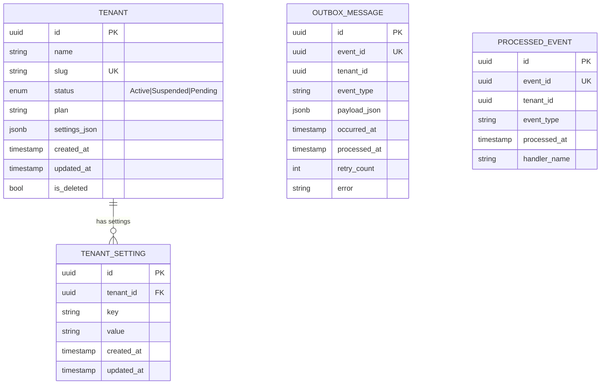
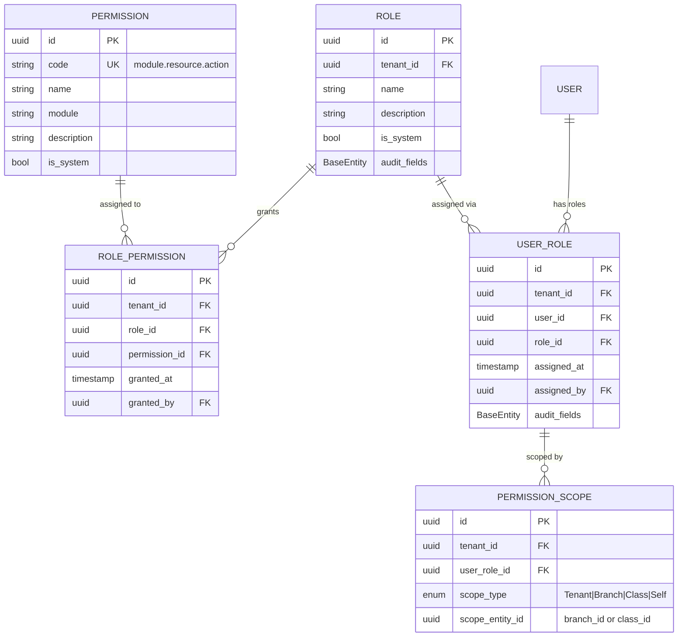
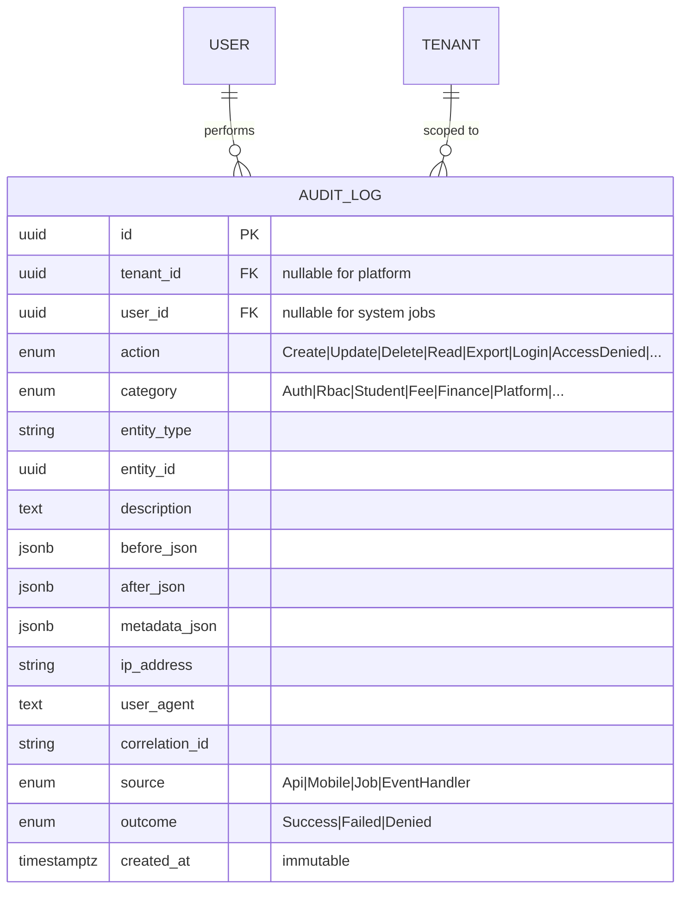
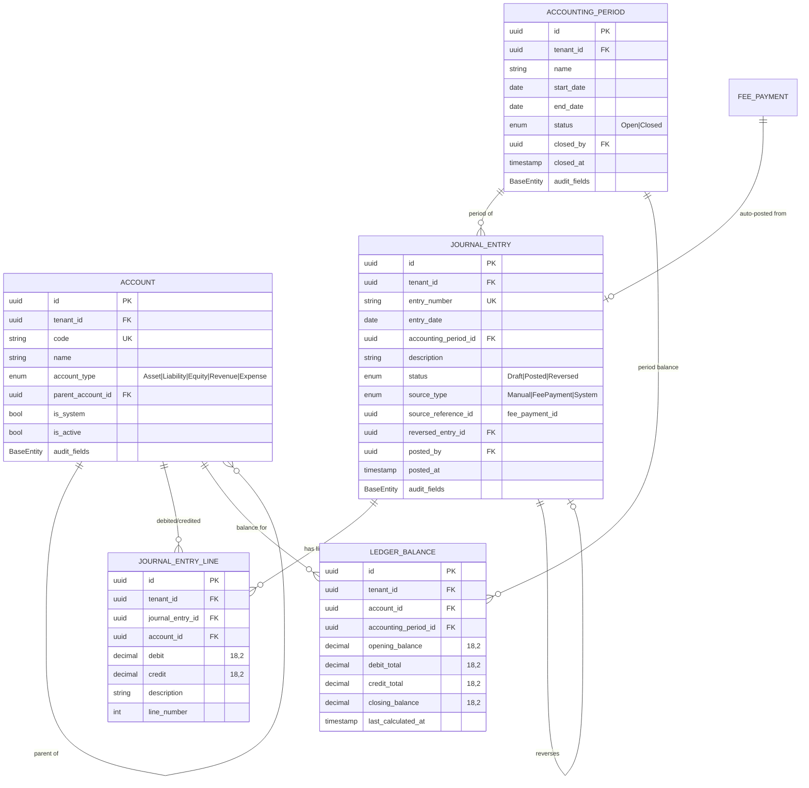
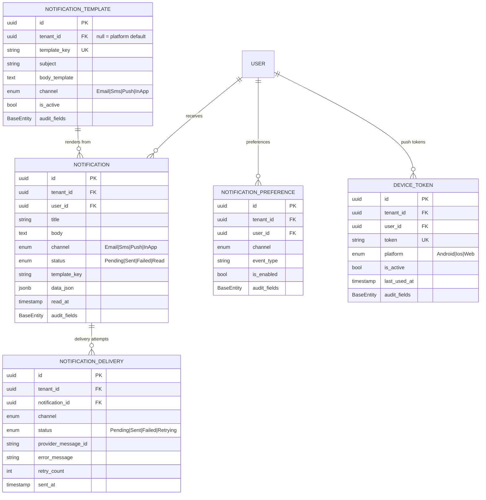
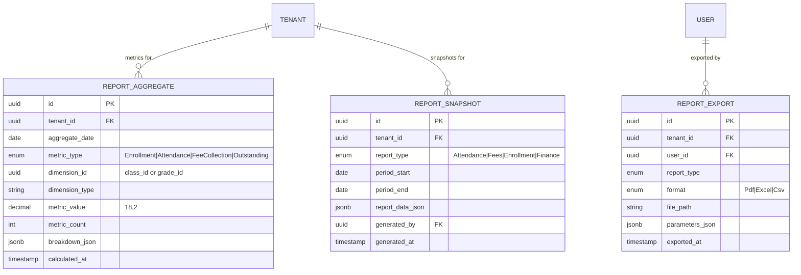
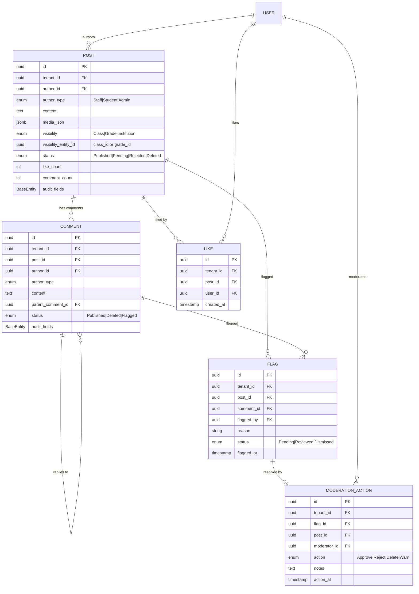
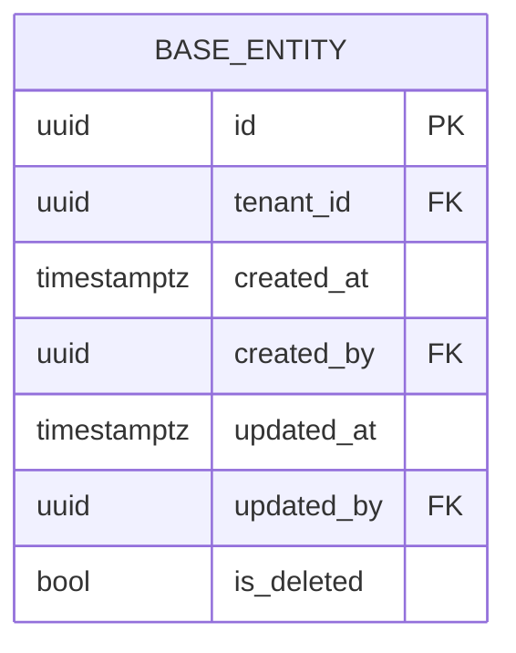

# Module-Wise ER Diagrams
## Student Management SaaS Platform

**Version:** 1.1  
**Database:** **MySQL 8** — **database-per-tenant** (not a single shared schema)  
**As implemented (May 2026):**

| Store | EF context | Typical database | Tables in scope today |
|-------|------------|------------------|------------------------|
| Platform catalog | `PlatformDbContext` | `schoolsaas_platform` | `tenants`, `tenant_settings`, `permissions` (catalog) |
| Per-tenant app data | `ApplicationDbContext` | `ss_t_{slug}` on tenant `db_server` | users, RBAC, `audit_logs`, outbox, `tenant_isolation_probes` |

Diagrams below still show logical **module** relationships. Physical placement: platform-only entities live only in the platform DB; tenant-scoped entities live only in that tenant’s DB (each row still has `tenant_id` for filters and tests).

**Convention:** Tenant-scoped tables include `tenant_id`. The `tenants` registry is **not** replicated into tenant databases.

---

## Legend

| Symbol | Meaning |
|---|---|
| PK | Primary key (`uuid`) |
| FK | Foreign key |
| UK | Unique constraint |
| `BaseEntity` | `id`, `tenant_id`, `created_at`, `updated_at`, `created_by`, `updated_by`, `is_deleted` |

**Client modules** (Admin Web App, Parent App, Student App, DevOps) have **no database entities** — they consume APIs only.

---

## Cross-Module Overview

High-level relationships between module entity groups:

```mermaid
erDiagram
    TENANT ||--o{ TENANT_SETTING : has
    TENANT ||--o{ USER : owns
    TENANT ||--o{ ACADEMIC_YEAR : has
    TENANT ||--o{ STUDENT : has

    USER ||--|| USER_PROFILE : has
    USER ||--o{ USER_ROLE : assigned
    USER ||--o{ REFRESH_TOKEN : has

    ROLE ||--o{ USER_ROLE : grants
    ROLE ||--o{ ROLE_PERMISSION : has
    PERMISSION ||--o{ ROLE_PERMISSION : in

    ACADEMIC_YEAR ||--o{ GRADE : contains
    GRADE ||--o{ CLASS : contains
    CLASS ||--o{ SECTION : contains
    CLASS ||--o{ STUDENT_ENROLLMENT : enrolls
    STUDENT ||--o{ STUDENT_ENROLLMENT : has

    STUDENT ||--o{ ATTENDANCE_RECORD : tracked
    STUDENT ||--o{ FEE_INVOICE : billed
    STUDENT ||--o{ GUARDIAN : linked_via
    GUARDIAN ||--o{ STUDENT_GUARDIAN : links

    FEE_PAYMENT ||--o| JOURNAL_ENTRY : posts_to
    STUDENT ||--o{ COURSE_ENROLLMENT : learns
    USER ||--o{ NOTIFICATION : receives
    USER ||--o{ AUDIT_LOG : performs
```

---

# MODULE 0: Platform Foundation

**Tables:** `tenants`, `tenant_settings`, `outbox_messages`, `processed_events`



**Notes:**
- `tenants` is **platform-level** — no `tenant_id` self-reference
- `outbox_messages` and `processed_events` support transactional outbox + idempotent consumers

---

# MODULE 1: Identity & Authentication

**Tables:** `users`, `user_profiles`, `refresh_tokens`, `login_attempts`, `user_invitations`, `password_reset_tokens`

```mermaid
erDiagram
    USER {
        uuid id PK
        uuid tenant_id FK
        string email UK
        string password_hash
        enum status "Active|Inactive|Locked"
        bool email_confirmed
        timestamp last_login_at
        BaseEntity audit_fields
    }

    USER_PROFILE {
        uuid id PK
        uuid tenant_id FK
        uuid user_id FK UK
        string first_name
        string last_name
        string phone
        string avatar_url
        jsonb preferences_json
        BaseEntity audit_fields
    }

    REFRESH_TOKEN {
        uuid id PK
        uuid tenant_id FK
        uuid user_id FK
        string token_hash UK
        timestamp expires_at
        timestamp revoked_at
        string replaced_by_token
        string ip_address
        BaseEntity audit_fields
    }

    LOGIN_ATTEMPT {
        uuid id PK
        uuid tenant_id FK
        string email
        uuid user_id FK
        bool success
        string failure_reason
        string ip_address
        string user_agent
        timestamp attempted_at
    }

    USER_INVITATION {
        uuid id PK
        uuid tenant_id FK
        string email
        string token_hash UK
        uuid invited_by FK
        uuid role_id FK
        enum status "Pending|Accepted|Expired"
        timestamp expires_at
        timestamp accepted_at
        BaseEntity audit_fields
    }

    PASSWORD_RESET_TOKEN {
        uuid id PK
        uuid tenant_id FK
        uuid user_id FK
        string token_hash UK
        timestamp expires_at
        timestamp used_at
        BaseEntity audit_fields
    }

    USER ||--|| USER_PROFILE : "has profile"
    USER ||--o{ REFRESH_TOKEN : "has tokens"
    USER ||--o{ LOGIN_ATTEMPT : "attempts"
    USER ||--o{ PASSWORD_RESET_TOKEN : "reset tokens"
    USER ||--o{ USER_INVITATION : "invited as"
```

**Notes:**
- `email` unique per `(tenant_id, email)`
- Super Admin users may have `tenant_id = null` (platform scope)

---

# MODULE 2: RBAC & Permissions

**Tables:** `permissions`, `roles`, `role_permissions`, `user_roles`, `permission_scopes`



**Notes:**
- `permissions` is **global catalog** (no tenant_id)
- `roles` are tenant-scoped; system roles (`IsSystem=true`) cannot be deleted
- Unique: `(role_id, permission_id)`, `(user_id, role_id)` per tenant

---

# MODULE 3: Audit Logging

**Tables:** `audit_logs`



**Notes:**
- **Append-only** — no updates or deletes
- Index: `(tenant_id, created_at DESC)`, `(entity_type, entity_id)`, `(user_id, created_at)`
- Financial audit rows: 7-year minimum retention

---

# MODULE 4: Institution Management

**Tables:** `academic_years`, `terms`, `grades`, `classes`, `sections`, `subjects`, `class_subjects`, `staff`, `branches`

```mermaid
erDiagram
    ACADEMIC_YEAR {
        uuid id PK
        uuid tenant_id FK
        string name
        date start_date
        date end_date
        bool is_current
        enum status "Active|Closed|Upcoming"
        BaseEntity audit_fields
    }

    TERM {
        uuid id PK
        uuid tenant_id FK
        uuid academic_year_id FK
        string name
        date start_date
        date end_date
        int sort_order
        BaseEntity audit_fields
    }

    GRADE {
        uuid id PK
        uuid tenant_id FK
        string name
        string code
        int sort_order
        BaseEntity audit_fields
    }

    CLASS {
        uuid id PK
        uuid tenant_id FK
        uuid grade_id FK
        uuid academic_year_id FK
        string name
        int capacity
        uuid class_teacher_id FK
        BaseEntity audit_fields
    }

    SECTION {
        uuid id PK
        uuid tenant_id FK
        uuid class_id FK
        string name
        int capacity
        BaseEntity audit_fields
    }

    SUBJECT {
        uuid id PK
        uuid tenant_id FK
        string name
        string code UK
        string description
        BaseEntity audit_fields
    }

    CLASS_SUBJECT {
        uuid id PK
        uuid tenant_id FK
        uuid class_id FK
        uuid subject_id FK
        uuid teacher_id FK
        BaseEntity audit_fields
    }

    STAFF {
        uuid id PK
        uuid tenant_id FK
        uuid user_id FK UK
        string employee_code UK
        string designation
        enum status "Active|Inactive"
        date join_date
        BaseEntity audit_fields
    }

    BRANCH {
        uuid id PK
        uuid tenant_id FK
        string name
        string code UK
        string address
        bool is_main
        BaseEntity audit_fields
    }

    ACADEMIC_YEAR ||--o{ TERM : "has terms"
    ACADEMIC_YEAR ||--o{ CLASS : "for year"
    GRADE ||--o{ CLASS : "contains"
    CLASS ||--o{ SECTION : "has sections"
    CLASS ||--o{ CLASS_SUBJECT : "teaches"
    SUBJECT ||--o{ CLASS_SUBJECT : "mapped to"
    STAFF ||--o{ CLASS : "class teacher"
    STAFF ||--o{ CLASS_SUBJECT : "teaches"
    USER ||--o| STAFF : "linked to"
    TENANT ||--o{ BRANCH : "has campuses"
```

**Notes:**
- Only one `is_current = true` academic year per tenant
- `classes` unique: `(tenant_id, grade_id, academic_year_id, name)`

---

# MODULE 5: Student Management

**Tables:** `students`, `student_enrollments`, `guardians`, `student_guardians`, `student_documents`, `admission_applications`

```mermaid
erDiagram
    STUDENT {
        uuid id PK
        uuid tenant_id FK
        string admission_number UK
        string first_name
        string last_name
        date date_of_birth
        enum gender
        string blood_group
        string address
        string phone
        string email
        uuid user_id FK "optional student login"
        enum status "Active|Withdrawn|Alumni"
        BaseEntity audit_fields
    }

    STUDENT_ENROLLMENT {
        uuid id PK
        uuid tenant_id FK
        uuid student_id FK
        uuid academic_year_id FK
        uuid class_id FK
        uuid section_id FK
        date enrolled_date
        date withdrawn_date
        enum status "Active|Transferred|Withdrawn|Promoted"
        BaseEntity audit_fields
    }

    GUARDIAN {
        uuid id PK
        uuid tenant_id FK
        uuid user_id FK "optional parent login"
        string first_name
        string last_name
        string email UK
        string phone UK
        string occupation
        string address
        BaseEntity audit_fields
    }

    STUDENT_GUARDIAN {
        uuid id PK
        uuid tenant_id FK
        uuid student_id FK
        uuid guardian_id FK
        enum relationship "Father|Mother|Guardian|Other"
        bool is_primary
        bool is_emergency_contact
        BaseEntity audit_fields
    }

    STUDENT_DOCUMENT {
        uuid id PK
        uuid tenant_id FK
        uuid student_id FK
        string document_type
        string file_name
        string file_path
        string mime_type
        long file_size
        uuid uploaded_by FK
        BaseEntity audit_fields
    }

    ADMISSION_APPLICATION {
        uuid id PK
        uuid tenant_id FK
        string application_number UK
        string applicant_name
        jsonb application_data_json
        enum status "Pending|Approved|Rejected"
        uuid reviewed_by FK
        uuid student_id FK "after approval"
        BaseEntity audit_fields
    }

    STUDENT ||--o{ STUDENT_ENROLLMENT : "enrolled"
    CLASS ||--o{ STUDENT_ENROLLMENT : "class of"
    SECTION ||--o{ STUDENT_ENROLLMENT : "section of"
    ACADEMIC_YEAR ||--o{ STUDENT_ENROLLMENT : "year of"
    STUDENT ||--o{ STUDENT_GUARDIAN : "linked"
    GUARDIAN ||--o{ STUDENT_GUARDIAN : "linked"
    STUDENT ||--o{ STUDENT_DOCUMENT : "has documents"
    STUDENT ||--o| ADMISSION_APPLICATION : "from application"
    USER ||--o| STUDENT : "login account"
    USER ||--o| GUARDIAN : "parent account"
```

**Notes:**
- `admission_number` unique per `(tenant_id, admission_number)`
- Unique: `(student_id, guardian_id)`, `(student_id, academic_year_id)` for active enrollment

---

# MODULE 6: Attendance

**Tables:** `attendance_sessions`, `attendance_records`, `attendance_edit_logs`, `leave_requests`

```mermaid
erDiagram
    ATTENDANCE_SESSION {
        uuid id PK
        uuid tenant_id FK
        uuid class_id FK
        uuid section_id FK
        date session_date
        uuid marked_by FK
        timestamp marked_at
        int total_students
        int present_count
        int absent_count
        BaseEntity audit_fields
    }

    ATTENDANCE_RECORD {
        uuid id PK
        uuid tenant_id FK
        uuid session_id FK
        uuid student_id FK
        uuid class_id FK
        date record_date
        enum status "Present|Absent|Late|Excused"
        string remarks
        uuid marked_by FK
        BaseEntity audit_fields
    }

    ATTENDANCE_EDIT_LOG {
        uuid id PK
        uuid tenant_id FK
        uuid attendance_record_id FK
        enum old_status
        enum new_status
        uuid edited_by FK
        string reason
        timestamp edited_at
    }

    LEAVE_REQUEST {
        uuid id PK
        uuid tenant_id FK
        uuid student_id FK
        uuid submitted_by FK "guardian user"
        date start_date
        date end_date
        string reason
        enum status "Pending|Approved|Rejected"
        uuid reviewed_by FK
        timestamp reviewed_at
        BaseEntity audit_fields
    }

    ATTENDANCE_SESSION ||--o{ ATTENDANCE_RECORD : "contains"
    STUDENT ||--o{ ATTENDANCE_RECORD : "attendance of"
    CLASS ||--o{ ATTENDANCE_SESSION : "session for"
    ATTENDANCE_RECORD ||--o{ ATTENDANCE_EDIT_LOG : "edit history"
    STUDENT ||--o{ LEAVE_REQUEST : "requests leave"
    GUARDIAN ||--o{ LEAVE_REQUEST : "submitted by"
```

**Notes:**
- Unique: `(tenant_id, class_id, student_id, record_date)`
- Edit window enforced at application layer (same-day default)

---

# MODULE 7: Fees Management

**Tables:** `fee_categories`, `fee_structures`, `fee_structure_items`, `class_fee_assignments`, `student_fee_accounts`, `fee_invoices`, `fee_invoice_items`, `fee_payments`, `fee_receipts`, `fee_concessions`

```mermaid
erDiagram
    FEE_CATEGORY {
        uuid id PK
        uuid tenant_id FK
        string name
        string code UK
        string description
        BaseEntity audit_fields
    }

    FEE_STRUCTURE {
        uuid id PK
        uuid tenant_id FK
        uuid academic_year_id FK
        string name
        enum status "Draft|Active|Archived"
        BaseEntity audit_fields
    }

    FEE_STRUCTURE_ITEM {
        uuid id PK
        uuid tenant_id FK
        uuid fee_structure_id FK
        uuid fee_category_id FK
        string description
        decimal amount "18,2"
        enum frequency "OneTime|Monthly|Term|Annual"
        BaseEntity audit_fields
    }

    CLASS_FEE_ASSIGNMENT {
        uuid id PK
        uuid tenant_id FK
        uuid class_id FK
        uuid fee_structure_id FK
        uuid academic_year_id FK
        BaseEntity audit_fields
    }

    STUDENT_FEE_ACCOUNT {
        uuid id PK
        uuid tenant_id FK
        uuid student_id FK UK
        decimal total_invoiced "18,2"
        decimal total_paid "18,2"
        decimal balance "18,2"
        BaseEntity audit_fields
    }

    FEE_INVOICE {
        uuid id PK
        uuid tenant_id FK
        uuid student_id FK
        string invoice_number UK
        date issue_date
        date due_date
        decimal total_amount "18,2"
        decimal paid_amount "18,2"
        decimal balance "18,2"
        enum status "Draft|Issued|PartiallyPaid|Paid|Overdue|Cancelled"
        BaseEntity audit_fields
    }

    FEE_INVOICE_ITEM {
        uuid id PK
        uuid tenant_id FK
        uuid fee_invoice_id FK
        uuid fee_category_id FK
        string description
        decimal amount "18,2"
        BaseEntity audit_fields
    }

    FEE_PAYMENT {
        uuid id PK
        uuid tenant_id FK
        uuid student_id FK
        string payment_reference UK
        decimal amount "18,2"
        enum payment_method "Cash|Cheque|BankTransfer|Online"
        date payment_date
        enum status "Completed|Voided"
        uuid collected_by FK
        string notes
        BaseEntity audit_fields
    }

    FEE_RECEIPT {
        uuid id PK
        uuid tenant_id FK
        uuid fee_payment_id FK UK
        string receipt_number UK
        string pdf_path
        timestamp generated_at
        BaseEntity audit_fields
    }

    FEE_PAYMENT_ALLOCATION {
        uuid id PK
        uuid tenant_id FK
        uuid fee_payment_id FK
        uuid fee_invoice_id FK
        decimal allocated_amount "18,2"
    }

    FEE_CONCESSION {
        uuid id PK
        uuid tenant_id FK
        uuid student_id FK
        uuid fee_invoice_id FK
        enum type "Percentage|Fixed|Scholarship"
        decimal value "18,2"
        enum status "Pending|Approved|Rejected"
        uuid approved_by FK
        BaseEntity audit_fields
    }

    FEE_CATEGORY ||--o{ FEE_STRUCTURE_ITEM : "categorizes"
    FEE_STRUCTURE ||--o{ FEE_STRUCTURE_ITEM : "contains items"
    FEE_STRUCTURE ||--o{ CLASS_FEE_ASSIGNMENT : "assigned to"
    CLASS ||--o{ CLASS_FEE_ASSIGNMENT : "uses structure"
    STUDENT ||--|| STUDENT_FEE_ACCOUNT : "has account"
    STUDENT ||--o{ FEE_INVOICE : "billed"
    FEE_INVOICE ||--o{ FEE_INVOICE_ITEM : "line items"
    STUDENT ||--o{ FEE_PAYMENT : "pays"
    FEE_PAYMENT ||--|| FEE_RECEIPT : "generates"
    FEE_PAYMENT ||--o{ FEE_PAYMENT_ALLOCATION : "allocates to"
    FEE_INVOICE ||--o{ FEE_PAYMENT_ALLOCATION : "paid by"
    STUDENT ||--o{ FEE_CONCESSION : "concession for"
```

**Notes:**
- `invoice_number` and `receipt_number` sequential per tenant
- Payments can split across multiple invoices via `fee_payment_allocations`

---

# MODULE 8: Finance & Double Entry Accounting

**Tables:** `accounts`, `journal_entries`, `journal_entry_lines`, `ledger_balances`, `accounting_periods`



**Rules:**
- Sum(debits) = Sum(credits) per journal entry
- Posted entries immutable — reversal creates linked entry
- Auto-post from `fee_payments` idempotent by `source_reference_id`

---

# MODULE 9: LMS (Learning Management System)

**Tables:** `courses`, `course_modules`, `course_contents`, `course_enrollments`, `assignments`, `assignment_submissions`, `quizzes`, `quiz_questions`, `quiz_attempts`, `report_cards`

```mermaid
erDiagram
    COURSE {
        uuid id PK
        uuid tenant_id FK
        uuid subject_id FK
        uuid class_id FK
        uuid academic_year_id FK
        string title
        string description
        enum status "Draft|Published|Archived"
        uuid created_by FK
        BaseEntity audit_fields
    }

    COURSE_MODULE {
        uuid id PK
        uuid tenant_id FK
        uuid course_id FK
        string title
        int sort_order
        BaseEntity audit_fields
    }

    COURSE_CONTENT {
        uuid id PK
        uuid tenant_id FK
        uuid course_module_id FK
        enum content_type "Pdf|Video|Link|Text"
        string title
        string file_path
        string external_url
        int sort_order
        BaseEntity audit_fields
    }

    COURSE_ENROLLMENT {
        uuid id PK
        uuid tenant_id FK
        uuid course_id FK
        uuid student_id FK
        date enrolled_date
        enum status "Active|Completed|Dropped"
        BaseEntity audit_fields
    }

    ASSIGNMENT {
        uuid id PK
        uuid tenant_id FK
        uuid course_id FK
        string title
        text description
        timestamp due_date
        decimal max_score "18,2"
        bool allow_late_submission
        BaseEntity audit_fields
    }

    ASSIGNMENT_SUBMISSION {
        uuid id PK
        uuid tenant_id FK
        uuid assignment_id FK
        uuid student_id FK
        string file_path
        text submission_text
        timestamp submitted_at
        decimal score "18,2"
        text feedback
        uuid graded_by FK
        timestamp graded_at
        enum status "Submitted|Graded|Late"
        BaseEntity audit_fields
    }

    QUIZ {
        uuid id PK
        uuid tenant_id FK
        uuid course_id FK
        string title
        int duration_minutes
        decimal passing_score "18,2"
        enum status "Draft|Published|Closed"
        BaseEntity audit_fields
    }

    QUIZ_QUESTION {
        uuid id PK
        uuid tenant_id FK
        uuid quiz_id FK
        enum question_type "Mcq|TrueFalse|ShortAnswer"
        text question_text
        jsonb options_json
        string correct_answer
        decimal points "18,2"
        int sort_order
        BaseEntity audit_fields
    }

    QUIZ_ATTEMPT {
        uuid id PK
        uuid tenant_id FK
        uuid quiz_id FK
        uuid student_id FK
        jsonb answers_json
        decimal score "18,2"
        timestamp started_at
        timestamp submitted_at
        enum status "InProgress|Submitted|Graded"
        BaseEntity audit_fields
    }

    REPORT_CARD {
        uuid id PK
        uuid tenant_id FK
        uuid student_id FK
        uuid academic_year_id FK
        uuid term_id FK
        jsonb grades_json
        decimal gpa "18,2"
        enum status "Draft|Published"
        uuid published_by FK
        timestamp published_at
        BaseEntity audit_fields
    }

    COURSE ||--o{ COURSE_MODULE : "has modules"
    COURSE_MODULE ||--o{ COURSE_CONTENT : "has content"
    COURSE ||--o{ COURSE_ENROLLMENT : "enrolls"
    STUDENT ||--o{ COURSE_ENROLLMENT : "enrolled in"
    COURSE ||--o{ ASSIGNMENT : "has assignments"
    ASSIGNMENT ||--o{ ASSIGNMENT_SUBMISSION : "submissions"
    STUDENT ||--o{ ASSIGNMENT_SUBMISSION : "submits"
    COURSE ||--o{ QUIZ : "has quizzes"
    QUIZ ||--o{ QUIZ_QUESTION : "has questions"
    QUIZ ||--o{ QUIZ_ATTEMPT : "attempts"
    STUDENT ||--o{ QUIZ_ATTEMPT : "takes"
    STUDENT ||--o{ REPORT_CARD : "report for"
    SUBJECT ||--o{ COURSE : "based on"
    CLASS ||--o{ COURSE : "for class"
```

---

# MODULE 10: Notifications

**Tables:** `notification_templates`, `notifications`, `notification_deliveries`, `notification_preferences`, `device_tokens`



---

# MODULE 11: Reporting & Analytics

**Tables:** `report_aggregates`, `report_snapshots`, `report_exports`

_Read-only derived data — no transactional writes from users directly._



**Notes:**
- Populated by background jobs: `DailyAggregationJob`, `MonthlyReportSnapshotJob`
- Every export creates an `audit_logs` entry + `report_exports` row

---

# MODULE 12: Social Networking

**Tables:** `posts`, `comments`, `likes`, `flags`, `moderation_actions`



---

# Client Modules (No Database Entities)

These modules are **UI/API consumers only**:

| Module | Technology | Data Source |
|---|---|---|
| Admin Web App | Angular 19 | All backend REST APIs |
| Parent App | Flutter | Identity, Student, Attendance, Fees, Notifications APIs |
| Student App | Flutter | Identity, Student, LMS, Attendance, Notifications APIs |
| Deployment & DevOps | Docker, GitHub Actions, Nginx | Infrastructure configs — no business DB |

---

# Shared Base Entity Pattern

All tenant-scoped business tables inherit:



---

# Table Count Summary

| Module | Tables | Phase |
|---|---|---|
| Platform Foundation | 4 | 1 |
| Identity & Authentication | 6 | 1 |
| RBAC & Permissions | 5 | 1 |
| Audit Logging | 1 | 1 |
| Institution Management | 9 | 1–2 |
| Student Management | 6 | 1 |
| Attendance | 4 | 1 |
| Fees Management | 11 | 1–2 |
| Finance & Accounting | 5 | 2 |
| LMS | 10 | 2 |
| Notifications | 5 | 1 |
| Reporting & Analytics | 3 | 2 |
| Social Networking | 5 | 3 |
| **Total** | **~74** | |

---

# Related Documents

- [`student_management_saas_complete_module_plan.md`](../student_management_saas_complete_module_plan.md)
- [`docs/universal-logging-policy.md`](universal-logging-policy.md)
- [`.cursor/rules/backend-ef-core-database.mdc`](../.cursor/rules/backend-ef-core-database.mdc)

---

**Document History**

| Version | Date | Changes |
|---|---|---|
| 1.0 | May 2026 | Initial module-wise ER diagrams for all 13 backend modules |
