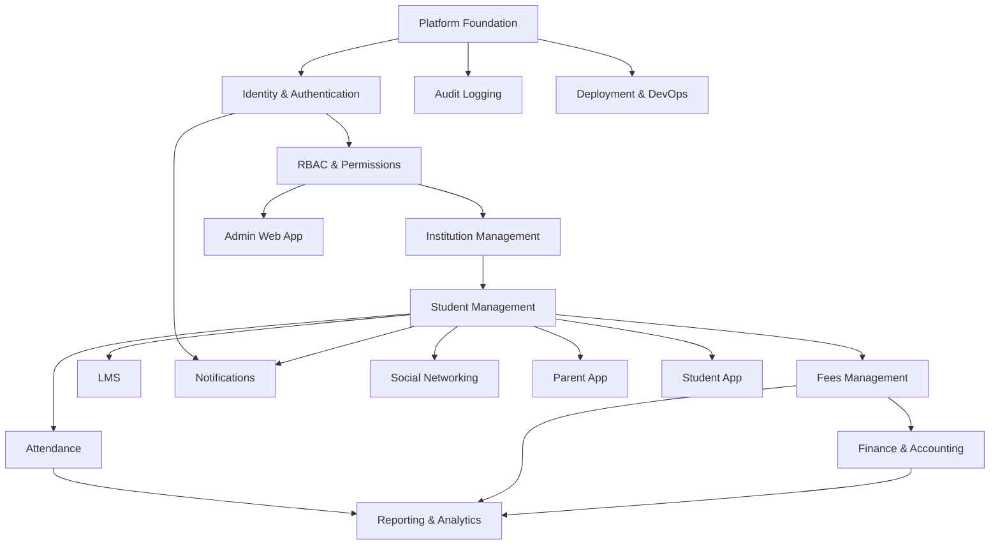

# Student Management SaaS Platform
## Complete Module Plan (Master Reference)

**Version:** 1.0  
**Last Updated:** May 2026  
**Status:** Planning — AI-assisted development ready  
**Architecture:** Modular Monolith → Microservices (future)

---

## Document Purpose

This is the **single master plan** covering every module in the platform. Use it for:

- Product scope and roadmap decisions
- Sprint and phase planning
- Cursor AI implementation context
- Cross-module dependency mapping
- Onboarding new team members

**Related files:**

| File | Purpose |
|---|---|
| [`backlog/mvp-phase1-linear-import.csv`](backlog/mvp-phase1-linear-import.csv) | Sprint-ready task backlog |
| [`backlog/mvp-phase1-all-sprints.md`](backlog/mvp-phase1-all-sprints.md) | **All sprints** — master sprint doc (Sprints 1–6) |
| [`backlog/MVP-PHASE1-SPRINT-GUIDE.md`](backlog/MVP-PHASE1-SPRINT-GUIDE.md) | MVP sprint calendar and DoD |
| [`backlog/sprint-1-l5-subtasks.md`](backlog/sprint-1-l5-subtasks.md) | Sprint 1 L5 subtask expansion |
| [`docs/universal-logging-policy.md`](docs/universal-logging-policy.md) | **Everything logged** — full audit matrix by module |
| [`docs/module-er-diagrams.md`](docs/module-er-diagrams.md) | **Module-wise ER diagrams** — all entities and relationships |
| [`.cursor/rules/`](.cursor/rules/) | Per-module Cursor architecture rules |
| [`AGENTS.md`](AGENTS.md) | AI agent entry point |

---

# 1. Vision & Product Goals

## Vision

Build a **production-grade, multi-tenant Student Management SaaS** for institutions (schools, colleges, training centers) with:

- Student Information System (SIS)
- Daily operations (attendance, fees)
- Financial accounting
- Learning management
- Parent and student mobile apps
- Internal community (social)
- Enterprise security, RBAC, and auditability

## Product Goals

| Goal | Description |
|---|---|
| Multi-institution SaaS | One platform, many tenants, strict isolation |
| Mobile-first | Parent and student apps as primary touchpoints |
| Enterprise security | RBAC, scope-based access, audit everywhere |
| Full auditability | Immutable logs for compliance and forensics |
| Modular architecture | Clear boundaries, event-driven integration |
| API-first | All clients consume versioned REST APIs |
| AI-assisted delivery | Cursor-driven implementation from this plan |

---

# 2. Technology Stack

## Backend

| Component | Technology |
|---|---|
| Runtime | ASP.NET Core 9 |
| Architecture | Clean Architecture, CQRS + MediatR |
| ORM | Entity Framework Core |
| Database | PostgreSQL |
| Cache | Redis |
| Message Bus | RabbitMQ |
| Logging | Serilog |
| Validation | FluentValidation |

## Frontend (Admin)

| Component | Technology |
|---|---|
| Framework | Angular 19 (standalone components) |
| UI | Angular Material |
| Data grids | AG Grid |
| State | RxJS / Signals |

## Mobile

| Component | Technology |
|---|---|
| Framework | Flutter |
| State | Riverpod |
| HTTP | Dio |

## Infrastructure

| Component | Technology |
|---|---|
| Containers | Docker |
| Reverse proxy | Nginx |
| CI/CD | GitHub Actions |
| Hosting (initial) | Ubuntu VPS |
| Storage (initial) | Local → MinIO/S3 (Phase 2) |

---

# 3. Architecture Overview

## Pattern

```
Modular Monolith (Phase 1–3)
    └── Extract to Microservices by domain (Phase 4+)
```

## Multi-Tenancy

- **Strategy:** Shared database, shared schema
- **Isolation:** `TenantId` column on all tenant-scoped entities
- **Enforcement:** Global EF query filter + middleware + integration tests
- **Resolution:** JWT `tenant_id` claim (server-side only)

## Cross-Cutting Concerns (Every Module)

| Concern | Implementation |
|---|---|
| Tenant isolation | `ITenantContext`, query filters, save interceptor |
| RBAC | `[RequirePermission]`, `AuthorizationBehavior` |
| Audit & logging | `AuditBehavior`, `AuditReadBehavior`, `IAuditService`, Serilog request logging — **everything significant logged** |
| Validation | FluentValidation per command |
| Soft delete | `IsDeleted` flag, never hard-delete business data |
| Events | Domain events → Outbox → RabbitMQ |
| API versioning | `/api/v1/{resource}` |
| Error handling | RFC 7807 ProblemDetails, `Result<T>` pattern |

## Domain Map



---

# 4. Module Index

| # | Module | Domain | MVP | Phase |
|---|---|---|---|---|
| 0 | Platform Foundation | Cross-cutting | ✅ | 1 |
| 1 | Identity & Authentication | Identity & Access | ✅ | 1 |
| 2 | RBAC & Permissions | Identity & Access | ✅ | 1 |
| 3 | Audit Logging | Compliance | ✅ | 1 |
| 4 | Institution Management | Institution | ✅ | 1 |
| 5 | Student Management | Student Lifecycle | ✅ | 1 |
| 6 | Attendance | Academic Operations | ✅ | 1 |
| 7 | Fees Management | Financial | ✅ | 1 |
| 8 | Notifications | Communication | ✅ | 1 |
| 9 | Admin Web App | Client Apps | ✅ | 1 |
| 10 | Parent App | Client Apps | ✅ | 1 |
| 11 | Deployment & DevOps | Infrastructure | ✅ | 1 |
| 12 | Finance & Accounting | Financial | ❌ | 2 |
| 13 | LMS | Academic Operations | ❌ | 2 |
| 14 | Student App | Client Apps | ❌ | 2 |
| 15 | Reporting & Analytics | Analytics | ❌ | 2 |
| 16 | Social Networking | Engagement | ❌ | 3 |

---

# 5. Module Specifications

---

## MODULE 0: Platform Foundation

**Domain:** Cross-cutting infrastructure  
**Priority:** P0 — blocks everything  
**Cursor rule:** `.cursor/rules/saas-platform-core.mdc`, `backend-*.mdc`

### Business Purpose

Shared kernel: solution structure, multi-tenancy, MediatR pipeline, outbox/events, caching, API conventions, result pattern, exception handling.

### Features

| Feature | Description |
|---|---|
| Solution scaffolding | Clean Architecture projects, module folders |
| Multi-tenancy | `ITenantContext`, query filters, save interceptor |
| MediatR pipeline | Validation, logging, tenant, authorization, audit behaviors |
| Event bus | Outbox pattern, RabbitMQ publisher, idempotent consumers |
| Caching | Redis with tenant-prefixed keys |
| API infrastructure | Versioning, Swagger, ProblemDetails, CORS |
| Shared abstractions | `BaseEntity`, `Result<T>`, `IntegrationEventBase` |

### Key Entities

`Tenant`, `TenantSetting`, `OutboxMessage`, `ProcessedEvent`

### Dependencies

- **Upstream:** None
- **Downstream:** All modules

### High-Risk Areas

- Tenant data leakage
- Outbox duplicate/lost events
- Module boundary violations

---

## MODULE 1: Identity & Authentication

**Domain:** Identity & Access Management  
**Priority:** P1  
**Cursor rule:** `.cursor/rules/module-identity-auth.mdc`

### Business Purpose

Register, authenticate, and manage users across tenants. JWT + refresh token API security for web and mobile.

### Features

| Feature | MVP | Phase 2+ |
|---|---|---|
| User registration & invitation | ✅ | |
| Login / logout | ✅ | |
| JWT + refresh token rotation | ✅ | |
| Password reset & change | ✅ | |
| Account lockout | ✅ | |
| MFA (TOTP) | | ✅ |
| Device management | | ✅ |
| OAuth / SSO | | ✅ |

### Key Entities

`User`, `UserProfile`, `RefreshToken`, `LoginAttempt`, `UserInvitation`, `PasswordResetToken`

### Permissions

```
auth.profile.read
auth.profile.update
auth.password.change
users.invite
users.manage
```

### APIs

| Method | Endpoint | Purpose |
|---|---|---|
| POST | `/api/v1/auth/login` | Login |
| POST | `/api/v1/auth/refresh` | Refresh token |
| POST | `/api/v1/auth/logout` | Logout |
| POST | `/api/v1/auth/register` | Register |
| POST | `/api/v1/auth/forgot-password` | Initiate reset |
| POST | `/api/v1/auth/reset-password` | Complete reset |
| GET | `/api/v1/auth/me` | Current user |
| PUT | `/api/v1/auth/me/password` | Change password |
| POST | `/api/v1/users/invite` | Admin invite |

### Events

`UserRegisteredIntegrationEvent`, `PasswordResetRequestedIntegrationEvent`, `UserLockedIntegrationEvent`

### Dependencies

- Platform Foundation
- **Downstream:** RBAC, all client apps, Notifications

---

## MODULE 2: RBAC & Permissions

**Domain:** Identity & Access Management  
**Priority:** P1  
**Cursor rule:** `.cursor/rules/module-rbac-permissions.mdc`

### Business Purpose

Fine-grained, scope-aware role-based access control at API and UI levels.

### Features

| Feature | MVP | Phase 2+ |
|---|---|---|
| Permission catalog | ✅ | |
| Role CRUD | ✅ | |
| Permission assignment to roles | ✅ | |
| User role assignment | ✅ | |
| Scope-based access (tenant/branch/class/self) | ✅ | |
| Permission caching (Redis) | ✅ | |
| Custom roles per tenant | ✅ | |
| Attribute-based access (ABAC) | | ✅ |

### Key Entities

`Permission`, `Role`, `RolePermission`, `UserRole`, `PermissionScope`

### Default Roles

`SuperAdmin`, `TenantAdmin`, `Principal`, `Teacher`, `Accountant`, `Parent`, `Student`

### Scope Types

| Scope | Access |
|---|---|
| Tenant | Full tenant data |
| Branch | Branch/campus only |
| Class | Assigned class(es) |
| Self | Own record / linked children |

### Permissions (meta)

```
roles.create | roles.update | roles.delete
roles.permissions.assign
users.roles.assign
permissions.read
```

### Events

`RolePermissionsChangedIntegrationEvent`, `UserRoleAssignedIntegrationEvent`

### Dependencies

- Identity & Authentication
- **Downstream:** Every business module, Admin Web App

---

## MODULE 3: Audit Logging

**Domain:** Compliance & Governance  
**Priority:** P1  
**Cursor rule:** `.cursor/rules/module-audit-logging.mdc`  
**Full policy:** [`docs/universal-logging-policy.md`](docs/universal-logging-policy.md)

### Business Purpose

**Universal logging:** every significant platform action produces an immutable audit record. Two layers — **Audit DB** (compliance) and **Serilog** (operational). Nothing important happens in silence.

### Core Principle

> If it happened, it must be traceable — who, what, when, where, and outcome.

### Features

| Feature | MVP | Phase 2+ |
|---|---|---|
| Auto-audit on all write commands | ✅ | |
| Auto-audit on sensitive reads (PII, financial) | ✅ | |
| Access denied (403) logging | ✅ | |
| Auth event logging (login, logout, failures) | ✅ | |
| HTTP request logging (every API call) | ✅ | |
| Export/download logging | ✅ | |
| File upload/download logging | ✅ | |
| Integration event publish/consume logging | ✅ | |
| Background job start/complete/fail logging | ✅ | |
| Super admin action logging | ✅ | |
| EF entity change capture (before/after) | ✅ | |
| Audit query API + viewer UI | ✅ | |
| Module/category filters in viewer | ✅ | |
| CSV export (export itself audited) | | ✅ |
| Monthly partitioning + cold archive | | ✅ |
| Impersonation audit trail | | ✅ |

### What Gets Logged (Summary)

| Category | Logged To | Examples |
|---|---|---|
| Authentication | Audit DB | Login, logout, failed login, password change, lockout |
| Authorization | Audit DB | Role changes, permission denied |
| Data writes | Audit DB | All Create/Update/Delete across every module |
| Sensitive reads | Audit DB | Student profile, fee ledger, documents |
| Exports & downloads | Audit DB | Reports, receipts, CSV, PDF |
| Financial ops | Audit DB | Payments, voids, journal post/reverse (7yr retention) |
| Files | Audit DB | Upload, download, delete |
| Notifications | Audit DB | Sent, failed, broadcast |
| Events | Audit DB | Published, consumed, failed, dead-lettered |
| Background jobs | Audit DB | Started, completed, failed |
| Platform/tenant | Audit DB | Tenant create, suspend, plan change |
| All HTTP requests | Serilog | Method, path, status, elapsed, correlation ID |
| Errors & slow requests | Serilog | Exceptions, >2s requests |

### Key Entities

`AuditLog` (append-only, extended schema with `Category`, `Source`, `Outcome`, `MetadataJson`)

### Permissions

```
audit.logs.read
audit.logs.export
audit.logs.read-all-tenant      # tenant admin — own tenant
audit.logs.read-platform        # super admin — cross-tenant
```

### MediatR Pipeline (logging-aware)

```
LoggingBehavior → ValidationBehavior → AuthorizationBehavior (+ AccessDenied audit)
  → TenantBehavior → AuditReadBehavior → AuditBehavior → Handler
```

### Dependencies

- Platform Foundation
- **Downstream:** Reporting & Analytics, compliance exports, super admin console

---

## MODULE 4: Institution Management

**Domain:** Institution & Academic Structure  
**Priority:** P2  
**Cursor rule:** `.cursor/rules/module-institution.mdc`

### Business Purpose

Tenant onboarding and organizational skeleton: academic years, grades, classes, sections, subjects, staff.

### Features

| Feature | MVP | Phase 2+ |
|---|---|---|
| Tenant provisioning | ✅ | |
| Tenant suspend/activate | ✅ | |
| Academic years & terms | ✅ | |
| Grades, classes, sections | ✅ | |
| Subjects & curriculum mapping | ✅ | |
| Staff profiles & user linking | ✅ | |
| Branches/campuses | | ✅ |
| Departments | | ✅ |
| Subscription plans | | ✅ |
| White-label / branding | | ✅ |
| Year-end promotion wizard | | ✅ |

### Key Entities

`Tenant`, `AcademicYear`, `Term`, `Grade`, `Class`, `Section`, `Subject`, `ClassSubject`, `Staff`, `Branch`

### Permissions

```
institution.tenant.create       # super-admin
institution.tenant.manage
institution.academic-years.manage
institution.classes.manage
institution.subjects.manage
institution.staff.manage
```

### Hierarchy

```
Tenant → AcademicYear → Grade → Class → Section
                              ↘ Subject (ClassSubject)
Staff → linked to User
```

### Events

`TenantCreatedIntegrationEvent`, `AcademicYearChangedIntegrationEvent`

### Dependencies

- Identity, RBAC
- **Downstream:** Student Management, Attendance, Fees, LMS, Reporting

---

## MODULE 5: Student Management

**Domain:** Student Lifecycle  
**Priority:** P2  
**Cursor rule:** `.cursor/rules/module-students.mdc`

### Business Purpose

Single source of truth for student identity, enrollment, guardians, and documents.

### Features

| Feature | MVP | Phase 2+ |
|---|---|---|
| Student CRUD | ✅ | |
| Admission number generation | ✅ | |
| Enrollment in class/section | ✅ | |
| Guardian management & linking | ✅ | |
| Student documents (upload/list) | ✅ | |
| Transfer & withdrawal | ✅ | |
| Bulk import (Excel) | | ✅ |
| Custom fields per institution | | ✅ |
| ID card generation | | ✅ |
| Alumni management | | ✅ |
| Promotion wizard | | ✅ |

### Key Entities

`Student`, `StudentEnrollment`, `Guardian`, `StudentGuardian`, `StudentDocument`, `AdmissionApplication`

### Permissions

```
students.profile.create | .read | .update | .delete
students.enrollment.manage
students.guardians.manage
students.documents.manage
```

### Events

`StudentAdmittedIntegrationEvent`, `StudentPromotedIntegrationEvent`, `StudentWithdrawnIntegrationEvent`, `GuardianLinkedIntegrationEvent`

### Dependencies

- Institution Management, RBAC
- **Downstream:** Attendance, Fees, LMS, Parent App, Student App, Social, Reporting

---

## MODULE 6: Attendance

**Domain:** Academic Operations  
**Priority:** P3  
**Cursor rule:** `.cursor/rules/module-attendance.mdc`

### Business Purpose

Track daily student presence with minimal teacher friction; notify parents of absences.

### Features

| Feature | MVP | Phase 2+ |
|---|---|---|
| Daily bulk attendance marking | ✅ | |
| Present / Absent / Late / Excused | ✅ | |
| Edit window policy | ✅ | |
| Student attendance history | ✅ | |
| Leave request (submit) | ✅ | |
| Leave approval workflow | | ✅ |
| Subject-wise attendance | | ✅ |
| Staff attendance | | ✅ |
| Biometric / RFID / QR | | ✅ |
| Geo-fenced attendance | | ✅ |

### Key Entities

`AttendanceSession`, `AttendanceRecord`, `AttendanceEditLog`, `LeaveRequest`

### Permissions

```
attendance.records.mark | .read | .edit
attendance.leave.submit | .approve
attendance.report.read
```

### Events

`AttendanceMarkedIntegrationEvent`, `AttendanceEditedIntegrationEvent`, `LeaveApprovedIntegrationEvent`

### Background Jobs

`DailyAbsenteeNotificationJob`

### Dependencies

- Student Management, Institution, RBAC, Notifications
- **Downstream:** Parent App, Reporting

---

## MODULE 7: Fees Management

**Domain:** Financial Operations  
**Priority:** P3  
**Cursor rule:** `.cursor/rules/module-fees.mdc`

### Business Purpose

Fee structure definition, invoicing, payment collection, receipts, concessions, and dues tracking.

### Features

| Feature | MVP | Phase 2+ |
|---|---|---|
| Fee categories & structures | ✅ | |
| Class fee assignment | ✅ | |
| Bulk invoice generation | ✅ | |
| Manual payment collection | ✅ | |
| Receipt generation (PDF) | ✅ | |
| Student fee ledger | ✅ | |
| Outstanding dues tracking | ✅ | |
| Concessions & scholarships | | ✅ |
| Online payment gateway | | ✅ |
| Installments & fine rules | | ✅ |
| Refunds | | ✅ |

### Key Entities

`FeeCategory`, `FeeStructure`, `FeeStructureItem`, `ClassFeeAssignment`, `FeeInvoice`, `FeeInvoiceItem`, `FeePayment`, `FeeReceipt`, `StudentFeeAccount`, `FeeConcession`

### Permissions

```
fees.structure.manage
fees.invoices.create | .read | .cancel
fees.payments.collect
fees.concessions.apply | .approve
fees.reports.read
```

### Events

`FeeInvoiceGeneratedIntegrationEvent`, `FeePaymentReceivedIntegrationEvent`, `FeeOverdueIntegrationEvent`

### Payment Gateways (Phase 2)

Abstract provider: Razorpay, Cashfree, PhonePe

### Dependencies

- Student Management, Institution
- **Downstream:** Finance & Accounting, Notifications, Parent App, Reporting

---

## MODULE 8: Finance & Double Entry Accounting

**Domain:** Financial Operations  
**Priority:** P4 (Phase 2)  
**Cursor rule:** _(create in Phase 2)_

### Business Purpose

Institution-grade financial record-keeping with automatic posting from fee transactions.

### Features

| Feature | Phase |
|---|---|
| Chart of accounts | 2 |
| Manual journal entries | 2 |
| Post / reverse entries | 2 |
| Auto-posting from fee payments | 2 |
| Account ledger | 2 |
| Trial balance | 2 |
| Income statement (P&L) | 2 |
| Balance sheet | 2 |
| Expense management | 3 |
| Bank reconciliation | 3 |

### Key Entities

`Account`, `JournalEntry`, `JournalEntryLine`, `LedgerBalance`, `AccountingPeriod`

### Permissions

```
finance.coa.manage
finance.journal.create | .post | .reverse
finance.reports.view
finance.period.close
```

### Rules

- Debits must equal credits
- Posted entries immutable — reversal only
- Auto-posting idempotent by `fee_payment_id`

### Events

Consumes `FeePaymentReceivedIntegrationEvent` → creates journal entry

### Dependencies

- Fees Management
- **Downstream:** Reporting & Analytics

---

## MODULE 9: LMS (Learning Management System)

**Domain:** Academic Operations  
**Priority:** P4 (Phase 2)  
**Cursor rule:** _(create in Phase 2)_

### Business Purpose

Deliver and track digital learning within the institution's academic structure.

### Features

| Feature | Phase |
|---|---|
| Course & module creation | 2 |
| Content upload (PDF, video links) | 2 |
| Course publish & enrollment | 2 |
| Assignments & submissions | 2 |
| Assignment grading | 2 |
| Quizzes & auto-grading | 2 |
| Report cards | 2 |
| Video lessons (hosted) | 3 |
| Certificates | 3 |
| Discussion boards | 3 |

### Key Entities

`Course`, `CourseModule`, `CourseContent`, `CourseEnrollment`, `Assignment`, `AssignmentSubmission`, `Quiz`, `QuizQuestion`, `QuizAttempt`, `ReportCard`

### Permissions

```
lms.content.manage
lms.course.publish
lms.assignment.create
lms.submission.grade
lms.quiz.manage
lms.report-card.generate
```

### Dependencies

- Institution (subjects/classes), Student Management
- **Downstream:** Student App, Parent App, Reporting

---

## MODULE 10: Notifications

**Domain:** Communication & Engagement  
**Priority:** P3  
**Cursor rule:** `.cursor/rules/module-notifications.mdc`

### Business Purpose

Multi-channel notification engine driven by domain events.

### Features

| Feature | MVP | Phase 2+ |
|---|---|---|
| Notification templates | ✅ | |
| Email dispatch | ✅ | |
| In-app notifications | ✅ | |
| Event-driven handlers | ✅ | |
| User preferences (opt-out) | ✅ | |
| Admin broadcast | | ✅ |
| SMS | | ✅ |
| Push (FCM) | | ✅ |
| Delivery retry & DLQ | ✅ | |

### Key Entities

`NotificationTemplate`, `Notification`, `NotificationDelivery`, `NotificationPreference`, `DeviceToken`

### MVP Event Triggers

| Event | Template |
|---|---|
| Absent attendance | `attendance-absent` |
| Fee payment received | `fee-payment-confirmation` |
| Guardian linked | `guardian-portal-invite` |
| Password reset | `password-reset` |

### Permissions

```
notifications.template.manage
notifications.broadcast.send
notifications.inbox.read
notifications.preferences.manage
```

### Dependencies

- Platform Event Bus, Identity
- **Consumed by:** All modules publishing events

---

## MODULE 11: Reporting & Analytics

**Domain:** Analytics & Compliance  
**Priority:** P5 (Phase 2)  
**Cursor rule:** _(create in Phase 2)_

### Business Purpose

Operational dashboards, standard reports, and data export for administrators.

### Features

| Feature | Phase |
|---|---|
| Admin dashboard (enrollment, attendance, fees) | 2 |
| Attendance reports | 2 |
| Fee collection reports | 2 |
| Outstanding dues report | 2 |
| Student enrollment report | 2 |
| PDF / Excel export | 2 |
| Financial statements (from Finance module) | 2 |
| Custom report builder | 3 |
| Predictive analytics | 4 |

### Permissions

```
reports.dashboard.view
reports.attendance.view
reports.fees.view
reports.enrollment.view
reports.finance.view
reports.export
```

### Background Jobs

`DailyAggregationJob`, `MonthlyReportSnapshotJob`

### Dependencies

- All business modules (read-only aggregates)
- Audit Logging (export audit)

---

## MODULE 12: Social Networking

**Domain:** Engagement  
**Priority:** P6 (Phase 3)  
**Cursor rule:** _(create in Phase 3)_

### Business Purpose

Institution-scoped community feed with moderation and safety controls.

### Features

| Feature | Phase |
|---|---|
| Posts & feed | 3 |
| Comments & likes | 3 |
| Announcements | 3 |
| Content flagging | 3 |
| Moderation queue | 3 |
| Classroom groups | 3 |
| Events | 4 |

### Key Entities

`Post`, `Comment`, `Like`, `Flag`, `ModerationAction`

### Permissions

```
social.post.create | .delete
social.post.moderate
social.comment.create
social.feed.read
```

### Visibility Scopes

Class, grade, institution-wide (within tenant)

### Dependencies

- Identity, Student/Staff profiles, Notifications
- **Primary clients:** Student App, Parent App

---

## MODULE 13: Admin Web App

**Domain:** Client Applications  
**Priority:** P2–P5  
**Cursor rule:** `.cursor/rules/frontend-angular-admin.mdc`

### Business Purpose

Angular admin portal for tenant administrators, teachers, and accountants.

### Feature Routes (by module)

| Route | Module | Phase |
|---|---|---|
| `/login` | Identity | 1 |
| `/dashboard` | Reporting | 2 |
| `/institution/*` | Institution | 1 |
| `/students/*` | Student Management | 1 |
| `/attendance/*` | Attendance | 1 |
| `/fees/*` | Fees | 1 |
| `/finance/*` | Finance | 2 |
| `/lms/*` | LMS | 2 |
| `/settings/roles` | RBAC | 1 |
| `/audit` | Audit | 1 |
| `/notifications` | Notifications | 1 |
| `/reports/*` | Reporting | 2 |
| `/social/moderation` | Social | 3 |

### Shared Components

App shell, sidebar, AG Grid wrapper, permission directive, confirm dialog, file upload, date range picker

### Dependencies

- All backend module APIs

---

## MODULE 14: Parent App (Flutter)

**Domain:** Client Applications  
**Priority:** P5 (MVP)  
**Cursor rule:** `.cursor/rules/mobile-flutter-parent.mdc`

### Business Purpose

Mobile app for parents: monitor children, view attendance/fees, receive notifications.

### Features

| Feature | MVP | Phase 2+ |
|---|---|---|
| Login & auth | ✅ | |
| Multi-child selector | ✅ | |
| Dashboard summary | ✅ | |
| Attendance view | ✅ | |
| Fee summary & history | ✅ | |
| Notification inbox | ✅ | |
| Leave request submit | | ✅ |
| Online fee payment | | ✅ |
| Report cards | | ✅ |
| Social feed | | ✅ |

### Dependencies

- Identity, Student (guardian link), Attendance, Fees, Notifications APIs

---

## MODULE 15: Student App (Flutter)

**Domain:** Client Applications  
**Priority:** P5 (Phase 2)  
**Cursor rule:** _(create in Phase 2)_

### Business Purpose

Mobile app for students: attendance, LMS, assignments, notifications.

### Features

| Feature | Phase |
|---|---|
| Login & profile | 2 |
| My attendance | 2 |
| Timetable | 2 |
| Courses & assignments | 2 |
| Quiz taking | 2 |
| Report cards | 2 |
| Notification inbox | 2 |
| Social feed | 3 |
| Fee payments | 3 |

### Dependencies

- Identity, Student, Attendance, LMS, Notifications APIs

---

## MODULE 16: Deployment & DevOps

**Domain:** Infrastructure  
**Priority:** P0 + P5  
**Cursor rule:** `.cursor/rules/devops-deployment.mdc`

### Business Purpose

CI/CD, containerization, VPS deployment, monitoring, backups.

### Features

| Feature | MVP | Phase 2+ |
|---|---|---|
| Docker local stack | ✅ | |
| API Dockerfile | ✅ | |
| GitHub Actions CI | ✅ | |
| Staging CD pipeline | ✅ | |
| Production CD pipeline | | ✅ |
| Nginx + SSL | ✅ | |
| Health checks | ✅ | |
| Structured logging (Serilog) | ✅ | |
| PostgreSQL backups | ✅ | |
| Seq / Elasticsearch | | ✅ |
| Prometheus + Grafana | | ✅ |
| Kubernetes + Helm | | ✅ |

### Environments

`local` → `staging` → `production`

### Dependencies

- Platform Foundation (buildable API)

---

# 6. Development Phases

## Phase 1 — MVP (Weeks 1–12)

**Goal:** Operable SaaS for daily school operations

| Module | Deliverable |
|---|---|
| Platform Foundation | Tenancy, pipeline, outbox, CI |
| Identity & Authentication | Login, JWT, invitations |
| RBAC & Permissions | Roles, permissions, scopes |
| Audit Logging | Auto-audit, viewer |
| Institution Management | Academic structure, staff |
| Student Management | CRUD, guardians, enrollment |
| Attendance | Daily marking |
| Fees Management | Structures, invoices, manual payment |
| Notifications | Email + in-app |
| Admin Web App | All Phase 1 feature UIs |
| Parent App | Attendance + fees view |
| DevOps | Docker, CI, staging deploy |

## Phase 2 — Extended ERP (Weeks 13–20)

| Module | Deliverable |
|---|---|
| Finance & Accounting | CoA, journals, auto-posting, statements |
| LMS | Courses, assignments, quizzes, report cards |
| Student App | Full student mobile experience |
| Reporting & Analytics | Dashboards, standard reports, export |
| Fees | Online payments, concessions |
| Notifications | SMS, push (FCM) |

## Phase 3 — Engagement (Weeks 21–26)

| Module | Deliverable |
|---|---|
| Social Networking | Feed, moderation |
| Institution | White-label, branches, bulk promotion |
| Student Management | Bulk import, custom fields, ID cards |
| Attendance | Subject-wise, leave approval, integrations |
| Reporting | Custom report builder |

## Phase 4 — Scale (Weeks 27+)

- Multi-region deployment
- Dedicated tenant infrastructure (enterprise tier)
- Microservice extraction (Finance, LMS, Notifications)
- AI analytics, predictive attendance
- Offline-first mobile

---

# 7. Implementation Hierarchy

Use this hierarchy for backlog and Cursor task generation:

```
Level 1: Domain          → e.g. Student Lifecycle
Level 2: Module          → e.g. Student Management
Level 3: Feature         → e.g. Guardian Linking
Level 4: Small Task      → e.g. LinkGuardianToStudentCommand
Level 5: Subtask         → e.g. Create StudentGuardianEntity
```

**Task sources:**

- L4 tasks: `backlog/mvp-phase1-linear-import.csv`
- All sprints overview: `backlog/mvp-phase1-all-sprints.md`
- L5 subtasks: `backlog/sprint-1-l5-subtasks.md` (Sprint 1 complete; extend for other sprints)

---

# 8. Security & Compliance Summary

| Control | Implementation |
|---|---|
| Authentication | JWT + refresh rotation, account lockout |
| Authorization | RBAC + scope resolver on every query/command |
| Tenant isolation | Query filter + interceptor + integration tests |
| Audit & logging | Append-only audit DB + Serilog on every request; all writes, auth, RBAC, sensitive reads, exports, files, events, jobs — see [`docs/universal-logging-policy.md`](docs/universal-logging-policy.md) |
| Rate limiting | Per-tenant API rate limits (Phase 2) |
| File upload | Type/size validation, signed URLs |
| Secrets | Env vars / GitHub Secrets, never in repo |
| PII | Scope-restricted access, masked in logs |

---

# 9. Repository Structure

```text
school/
├── src/
│   ├── SchoolSaaS.Api/
│   ├── SchoolSaaS.Application/
│   ├── SchoolSaaS.Domain/
│   ├── SchoolSaaS.Infrastructure/
│   ├── SchoolSaaS.Shared/
│   └── Modules/
│       ├── Platform/
│       ├── Identity/
│       ├── Institution/
│       ├── Students/
│       ├── Attendance/
│       ├── Fees/
│       ├── Finance/
│       ├── Lms/
│       ├── Notifications/
│       ├── Audit/
│       ├── Reporting/
│       └── Social/
├── frontend/                  # Angular 19 admin
├── mobile/                    # Flutter (parent + student)
├── tests/
│   ├── SchoolSaaS.UnitTests/
│   ├── SchoolSaaS.IntegrationTests/
│   └── SchoolSaaS.ArchitectureTests/
├── docker/
├── .github/workflows/
├── backlog/                   # Sprint backlogs
├── .cursor/rules/             # AI architecture rules
├── docs/
├── AGENTS.md
└── student_management_saas_complete_module_plan.md   # this file
```

---

# 10. AI-Assisted Development Workflow

```
Vision (this document)
    → Domain / Module selection
    → Feature from module spec
    → L4 task from backlog CSV
    → L5 subtasks from sprint docs
    → Cursor implementation (rules auto-apply)
    → Review (architecture tests, tenant isolation)
    → Merge (CI green)
    → Deploy (CD pipeline)
```

### Human Ownership Required

- Architecture decisions and module boundaries
- Security, RBAC permission design
- Finance logic and accounting rules
- Multi-tenant isolation verification
- Production deployment approval

### AI/Cursor Accelerates

- CRUD scaffolding (entity, command, handler, validator, endpoint)
- Angular pages and AG Grid lists
- Flutter screens
- EF migrations and configurations
- Unit and integration test boilerplate
- Docker and CI configs

---

# 11. Module Dependency Matrix

| Module | Depends On |
|---|---|
| Platform Foundation | — |
| Identity & Authentication | Platform Foundation |
| RBAC & Permissions | Identity |
| Audit Logging | Platform Foundation |
| Institution Management | Identity, RBAC |
| Student Management | Institution, RBAC |
| Attendance | Student, Institution, RBAC |
| Fees Management | Student, Institution |
| Finance & Accounting | Fees |
| LMS | Institution, Student |
| Notifications | Platform Events, Identity |
| Reporting & Analytics | All business modules |
| Social Networking | Identity, Student |
| Admin Web App | All backend APIs |
| Parent App | Identity, Student, Attendance, Fees, Notifications |
| Student App | Identity, Student, Attendance, LMS, Notifications |
| DevOps | Platform Foundation |

---

# 12. Success Metrics

| Phase | Metric |
|---|---|
| MVP | Tenant can onboard, manage students, mark attendance, collect fees, parent views data |
| Phase 2 | Auto accounting from fees, LMS assignments, student app live |
| Phase 3 | Social feed with moderation, custom reports |
| Ongoing | Zero cross-tenant incidents, 99.5% uptime, CI always green |

---

# 13. Document History

| Version | Date | Changes |
|---|---|---|
| 1.0 | May 2026 | Initial complete module plan — all 16 modules + phases |

---

**Next steps:** Use [`backlog/mvp-phase1-all-sprints.md`](backlog/mvp-phase1-all-sprints.md) for the full sprint plan; begin Sprint 1 with [`backlog/sprint-1-l5-subtasks.md`](backlog/sprint-1-l5-subtasks.md) and [`.cursor/rules/`](.cursor/rules/).
